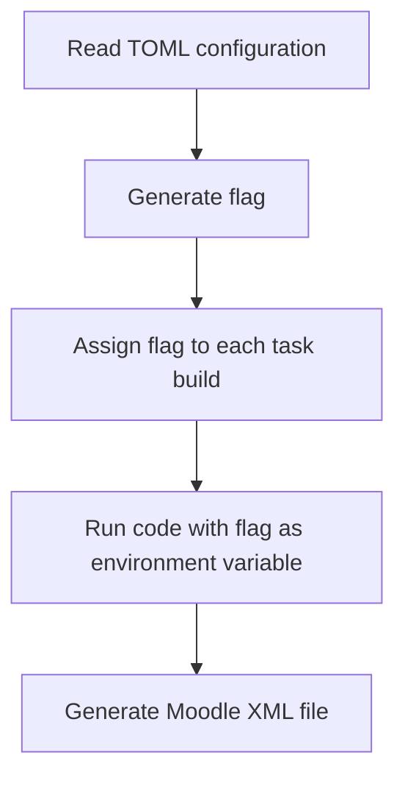

# _αἰνίσσομαι_ - *to speak in riddles*

This software tries to effortlessly turn your cybersecurity assignment dreams into reality—complete with automatic grading.
Think of it as a dynamic CTF challenge generator, but with a twist: every participant gets their own special flag to hunt down. No copy-pasting answers here!

It may or may not be completed. Heavily work-in-progress.

## Minimum Requirements

1. **Configuration File**: A `.toml` file defining the module, tasks, stages, build logic, and deployment rules.
2. **Task Build**: a shell-based or other type build system for generating task based on flag.
3. **Execution (CLI)**: CLI or other type system to specify tasks to be build with given options

## Configuration File Structure Overview

- `Module`: Structure for the module/course containing Uuid and name
- `Categories`: Logical sections of the course (e.g. “Week 1” or “Basics”)
- `Tasks`: Each Task belongs to a category and consists of:
    - `id`, `name`, `description`, `points` — basic task metadata.
    - `Stages`: Subtasks within a task containing:
        - `id`, `name`, `description`, `weight`
        - `flag` — method for generating user-specific or random flags.
    - `Build`: Build Instructions for task
        - `directory` — relative path to the task code.
        - `builder` — either `shell` or other type build specifing the entrypoint file.
    - `Build Output`: Specifies the files or resources produced by the build.
        - `resource` — downloadable binary or file.
        - `internal` — used internally (e.g., server script).
        - `readme` — instructions shown to users.
        - `meta` — JSON metadata (key-value config for dynamic tasks).
- `Flag Types`: Defines configurations for flag generation methods
    - `pure_random`: random string with given length.
    - `user_derived`: userid and algorithm based deterministic flags that requires the algorithm and the secret.
    - `rng_seed`: Generates consistent seed from user identity.
- `Deployment`: Configuration for deployment parameters
    - `build_timeout`: Max build time (in seconds).
    - `upload`: AWS S3 options for distributing artifacts:
        - `BUCKET_NAME`, `USE_PRE_SIGNED`, expiration policies, etc.


example configuration file is `course.toml`

### Supported Flag Types:
- user_derived algorithms: `HMAC_SHA3_256`

## Builder

Each task uses a **builder** that defines how the task is build. Different flags should produce different task instructions and answers. Meanwhile same flags should produce same instructions and answers deterministically
One way to achieve this is to utilize flag hash when generating different options for tasks.

### Supported builders
- `shell`: Runs a shell entrypoint (default: `entrypoint.sh`)

### Flags

- `pure_random` is passed as enviroment variable with name `FLAG_PURE_RANDOM_{task_id}`
- `user_derived` is passed as enviroment variable with name `FLAG_USER_DERIVED_{task_id}`
- `rng_seed`: Generates consistent seed from user identity. `FLAG_USER_SEED_{task_id}`

currently `user_derived` and `rng_seed` are functionally identical

## CLI

command line can be accessed by running command `aínigma` and the integrity of configuration file can be tested simply by

```bash aínigma --config <path-to-config>.toml generate --dry-run```

`generate` supports the following commands:

- `--output-dir <DIR>` 	Optional. Directory to write build files to. If omitted, uses a temp dir.
- `--task <task_id>` 	Build a specific task by its unique ID.
- `--category <NUMBER>` (Not yet implemented.) Build an entire category based on number.
- `--dry-run`           Performs a syntax check on the configuration and pretty prints it.
- `--number <N>`        Specifies the number of variants to build

command line also supports task generation to moodle xml file with `moodle` and following command:

- `--category <NAME>`   Moodle category name for grouping questions together.
- `--output <FILE>`     Name of output XML file (default: quiz.xml).

command line support `upload` to check bucket availability with command:

- `--check-bucket`  	Ensures the target bucket exists and is accessible.

All of these commands can also be seen with --help command.

## Example of Moodle workflow

#### License

<sup>
Licensed under the <a href="LICENSE">MIT License</a>.
</sup>

<br>

<sub>
Unless explicitly stated otherwise, any contribution intentionally submitted for inclusion in this project by you shall be licensed under the MIT License as stated above, without any additional terms or conditions.
</sub>
