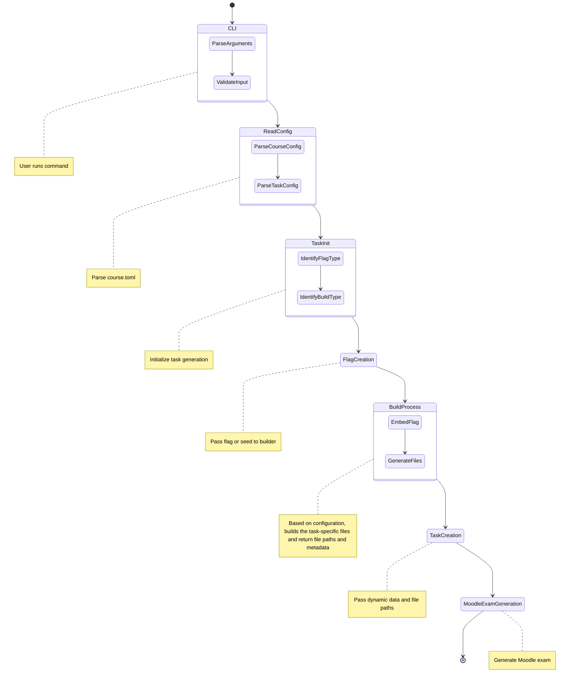

# Autograder

The purpose of this software is to make generation of cybersecurity-related assignments and their automatic grading possible.
It is one sort of CTF challenge generator, where every participant has an unique flag to discover.
The idea is converted to be more suitable for teaching.

The general idea is that completion of the task requires finding of *flag* to complete the assignment.
  * Flag can be just random hex string, but it can be also an answer for the maths assignment or some other tasks, where can be only one, unambiguous correct answer.

'Plagiarism' is indeed an issue, and it seems that students are inclined to put most effort for tasks if that is not required.
As a consequence, **the primary purpose** of this tool is to create uniquely tailored assignments for each student.
While it does not prevent on sharing the process flow for completing the study assignments, it at least makes it a bit more difficult.
Completion of the process is required to extract the flag.

As a result, this software should support many courses, and courses can have varying tasks.

# Requirements

## Use case 1 (Generate Moodle exam)

The user uses command-line interface (CLI) to generate Moodle exams for the course.
The course has configuration file `course.toml` and task-specific configuration files to build and generate exams.

For example, user runs following command to generate X amount (with `--number` parameter) of varying questions as Moodle exam, for a single task.
Configuration file and task specific build file has the required information to do so.

Moodle exam needs a question, and so-called "builder", based on the task-specific configuration, is responsible for providing that.

```cmd
autograder --config course.toml generate --week 1 --task 1 moodle --number X 
```


Overall process for task generation could look like as follows:



## Configuration and concept

Ideally, we want to have two places for rules for configuring courses and tasks; high level configuration file for the course, with some task-specific configurations, and separate task-specific file(s) for every task (Nix Flake file or shell script current options).

* On higher level, there is single configuration file per course. It should be human readable.
  * Good candidate is [TOML](https://toml.io/en/) - human readable and easy to parse with computers (unambiguously maps to hash table)
      * Overall configurations for the whole course (includes at least UUIDv7 identifier, short description, section of custom key-value pairs )
      * Course might have secret values, which are used to generate flags. These should be stored elsewhere. Identifier to each secret could be marked in the configuration file, and the secret is stored in other secure place. 
        * Secret should be in the flag configuration section
      * Configuration for every task
        * Directory for the task which is used as context for building the task. Contains build files.
        * What kind of build system task requires (Whether Nix Flake package or shell script is being used)
          * There must be some sort of marking for files which will be provided for the student
          * While not explicitly marked, some other files might be needed when deploying things in cloud etc.
        * What kind of flag mechanism the task uses, see #Flag generation
        * We might need to use internal SQLite database already, or in the future at least
            * A list of output files that task will provide (must be explicit path for each, instead of giving directory). It might be that these are used immediately and no need to cache. (Need to think more about this)
              * Builder returns the list 
            * To store completely random flags, connect the flag to correct user and task
            * Other things we need to remember and cannot be derived from the configuration file
              * If the flag generation provides seed instead of flag, we might not want to re-compute the solution
              * Instead, store solution to database, based on the build process
            * For exams in Moodle, we don't need this, as the information is stored to exam

### Rust implementation notes
* Rust, reading TOML: maybe use https://github.com/toml-rs/tomlj
* Configuration is parsed from TOML file and then configuration instance is created

* Design data structures in Rust which would represent the course
    * Course can have many tasks, tasks have explicit configuration options
      * Tasks have directory for build files
      * Tasks have build options (flag type, build system)
      
Relevant, but maybe no need to implement in the same file:

  * Task output files are stored somewhere (prune after X time)
    * Use unique tmp dir as base?
  * Some tasks require caching of data (random flags)

* SQLite database design likely needed for other than Moodle-based usage
  * Track random flags or task-specific correct answers, returned by builder
  * There is user, identified by (UUID Version 7) , with some other fields which act as identifer (GitHub repo, student-id), so that we can connect same user by using different means
      
If the task assignment requires question or other information (likely for Moodle exam generation), it should be defined here.

Also, if the question requires dynamic data (from the build process), there should be some placeholders in this initial data, which could be replaced by this dynamic data.

If the previous information is only needed for Moodle exam, then maybe it can be implemented as some sort of custom data field.

## Flag generation

This software will generate unique flag for every student, or either provides unique seed as base for the final correct answer (e.g. seed is used to pick random password from the list, so that password is different for every student, but selection process is reproducible with the original seed.)
In case of seed is generated, build process configuration will define how to use it.

In general, flags are either random or derived from the current "user".

Uniqueness in that case should be defined based on some unique identifier, which can be always connected to correct student, in case if we don't want to store flags.
We don't want to collect much personal information.
  * We can likely use user specific UUIDv7 as base
    * User is created when new (previously unknown) GitHub repository, student number, e.g. appears
    * State stored in SQLite database
  * Moodle-based exams do not need this, as everything must be generated beforehand and information remains in the exam. Moodle chooses quiz in random.


### Flag generation types

Flag should include task-specific prefix, separated by `:`. It helps to identify for which task this flag is related.
Suffix is random and varies between users. Note the impact for above definitions. 

 * Prefix can be short identifier for the task (must be unique on course wide)
 * Random hexstring suffix (32 bytes)
   * Need to use for Moodle-exams at least
      * In that case, stored to exams
      * Otherwise, need to store to database
 * Deterministic flag calculated by using HMAC(K, m) where K = (secret + user UUIDv7) and m = task identifier
    * It is likely enough that one secret needed per course (no need for per-task)
      * Task-based identifier results into completely different flag for every task
    * See https://en.wikipedia.org/wiki/HMAC
    * Maybe use HMAC-SHA3-256 (Note the version 3 here)
 * Deterministic RNG seed, derived from the user


#### Possible flags types as when passed further

* FlagAsEnvVariable (or just parameter for generate_task funciton, for example )
* FlagAsRNGSeed (during task build process, used for random selection if the tasks has such requirements)

### Rust notes

Think the functionality as set of public functions.
API should be simple and most of the functionality might be abstracted behind few functions.
Functions can be started to be designed in a sense, that they get called based on some configuration options defined in the configuration part.


If functionality would require the usage of many optional parameters, split functionality to multiple functions.
Use at least three different functions 
 * Generate random flag
   * Use real RNG
 * User-derived flags
  * Here we need at least secret, user UUIDv7 and task identifier for flag generation to be possible.
 * User-derived seed (Look for Rust pseudorngs to see what they can take and which one provides biggest entropy based on the seed). See HKDF down.

Flag could be also enum here; consider general API abstraction and simplicity if we actually need just one method for flag generation?
Compare versus three different functions and using structs as flags with shared trait.

Most of the logic can be implemented in single file (like `flag_generator.rs`)
Define the data structures which implement the required features.

Use cryptography only in this file. Good candidate libraries: 
  * SHA3: https://github.com/RustCrypto/hashes/tree/master/sha3
  * HMAC with SHA3: https://github.com/RustCrypto/MACs/tree/master/hmac

For RNG Seed: also possible to use HKDF https://en.wikipedia.org/wiki/HKDF

See some RNGs: https://rust-random.github.io/book/guide-rngs.html part Cryptographically secure pseudo-random number generators (CSPRNGs)

## Build process

Build process should follow the idea of functional programming paradigm; process takes some input and then produces some output.
With the same input, the output should be always same.
There should not be any side effects; this ensures reliability as well.
The building process should be able to scale concurrently.
On similar task (e.g. multiple students build the same tasks), cache should be possible to reuse. (Incremental building)

For every task in every course, there should be own build configuration.

### Build types

Currently, the build process could be defined either by using [Nix Flakes](https://nixos.wiki/wiki/Flakes) or shell scripts.
It is easier to get started with shell scripts.

By using Nix Flakes, we can guarantee reproducibility and the lack of side-effects.
The same configuration file should work as long as Nix does not break backwards compatibility.
The same file can be also used to generate Docker images - (or multitude of them).
Nix also maximises the cache efficiency.

Shell script is recommended to use Docker containers internally; so the task definition typically includes `Dockerfile` as well.
As a result, there is also some level of cache-reusage, and dependencies are not required from the host machine.
 * If the shell script option is selected, there must be a reserved option to configure the location of Docker daemon

* Build process receives flags or seed as arguments, and type of the build process is defined. 
  * Build process also receives the context from configuration (what is the directory for task-specific files)
    * Build process is initiated in this directory 
  * If the seed is received as an argument instead of pre-computed flag, then the build process must return the correct answer for the task (something unambiguous, student will return this to complete the task and get it reviewed).
  * If the build process receives flag, then it embeds it to the task where it is suitable to complete the task.
    * E.g. in reverse engineering task this is straightforward - you build the possible binary and pass the flag as parameter. Both Nix Flakes and shell scripts support command-line arguments, for example.

Currently, we focus only on file generation (could be also Docker images, or collection of images with Docker Compose file). 
If the task generates images which are used by student, then the build process also publishes images to `ghcr.io` and returns the tag(s) of the image(s). Return of the identifiers is not required, if the task returns docker compose file (then image names are there already).

For every task in every course, there is own image name. But the different images for the same task are identified by different tags.

**However, this should be noted in the general design:** *the build process should return the necessary information required to initiate the work with the task.*
This information can be embedded to the Moodle quiz, for example.


> Also, it is important to guarantee the complete chain of the process. When the build process is initiated, it must be obvious that caller can connect the returned result for correct task for correct user.

Guix can be also considered here instead of Nix: https://guix.gnu.org/

For Nix, `repl` can help learning: https://nix.dev/manual/nix/2.22/command-ref/new-cli/nix3-repl

More about Nix: https://nixos-and-flakes.thiscute.world/

### Notes for Rust implementation

In the context of this tool, this can be implemented as single file which exposes one or more public functions.
It also defines the types for process outputs. (Or also extensible argument type, which defines what the build process must do, if the parameters get complex)

E.g. `fn build_tasks(...) -> Result<GenerationOutputs, Error>` to initiate the build process with user and task specific parameters. 

Generation result returns the absolute paths of the output files, where the files for the students are marked separately.

Currently, we might need to consider implementing queue on caller side, and then this function takes actually list of tasks which are processed on parallel.
In the future, we need to use `async` so that this function does not halt the whole program.

### Future notes

In the future, build process is also expected to spawn instances in cloud or other remote locations (e.g. Kubernetes container), and return the possible address and credentials.
On complex cases, which requires connection over the internet, we should not provide own instance for every student.
Instead, we use single instance but students will use "connection parameter", so that service will work differently based on the student.

## CLI and Moodle exam notes

Moodle logic can be implemented in a single file. No need to expose it completely as public library.

We likely need Moodle only for manual usage (so it is enough that it can be used from CLI).
Overall, CLI is mainly needed for Moodle-based task generation, unless we also use it in GitHub pipeline as well.

Generation of Moodle exam should also require pre-defined questions. We get these from general configuration file.
There must be some logic to embed dynamic information from build process for the questions.
Moodle exam also needs filenames of the generated output files, as they appear when uploaded to the Moodle.

## Rust project structure

Initial, example file structure could look like as follows:
```text
src/
 - lib.rs
 - database.rs
 - flag_generation.rs
 - config.rs
 - moodle.rs
 - build_process.rs
 - bin/
    - cli.rs

```

## Sample configuration (what it could be, it is not needed to be exactly like this, modify this if changed!)

See [course.toml](course.toml) as an example.

General, when reading the configuration file, the reader should validate the syntax that necessary fields for each components are there. Extra, unspecified fields can be noted as warnings and ignored. If the week is defined, it must have tasks with minimal requirements.
Error messages should be clear.

The sample configuration file should be self-descriptive, but here are some highlights below.
No comprehensive if even something more is required.

Especially, as *a major considerable thing*, it is entirely possible that single build might need multiple flags to be embedded at once.
This means that task description that builder receives, can have list of flags to build.
In that case, there is a subtasks definition section, where the flags are linked to correct tasks and correct grading is based on that.


If task is specified for a week, then task must have ID, points and name to be set. 
 * Task must have build configuration and flag type
    * Build types
     * nix
     * shell
    * Overall task configuration must have at least one flag with type and identifier. Identifier must be linked to specific task and there must be flag for every task and no unused flags.
 
If the task has many subparts and all the flags must be embedded at once during build, then subtasks configuration format is used as seen from the example file.


### Build output output types

At least following should be supported Currently
  * resource - some data for student to download. Can be anything.
  * internal - for internal use e.g. host in cloud
  * meta | meta.json - key-value pairs of data. We can pre-define some keys such as `url` or `oci-image`. `json` likely optional, builder returns object
  * readme | readme.txt or readme.md some instructions with dynamic data, used as is


