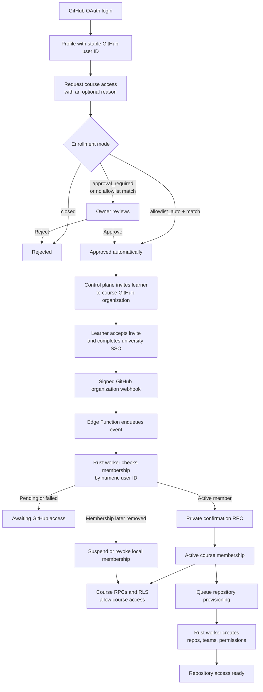

# Course enrollment flow



Owner approval or allowlist approval alone never grants course access. The learner must also be confirmed as a member of the course's GitHub organization.

## Control plane

A trusted Edge Function uses a GitHub App to invite by numeric user ID and accepts signed webhooks. It durably enqueues delivery IDs for a Rust worker (future `pgmq`), which verifies membership and calls the private confirmation/revocation RPC. After membership activation, separate idempotent jobs provision repositories, teams, and permissions. Periodic reconciliation covers missed webhooks; no browser token is trusted.

```
GitHub webhook
  → Supabase Edge Function
  → verify signature
  → enqueue event
  → return 2xx

Rust control-plane worker
  → consume queue
  → call GitHub API
  → verify current membership/IdP state
  → call private confirmation or revocation RPC
```

In short: the Edge Function is the authenticated ingress, the queue is the durable handoff, and the Rust worker performs retries, authorization reconciliation, and GitHub provisioning. PostgreSQL remains authoritative for Ainigma membership; repository provisioning is separate from the membership transaction.

Responsibilities:

- **Edge Function:** verify webhook signatures, deduplicate deliveries, enqueue events, and send invitations.
- **Queue (`pgmq` later):** provide durable handoff and retryable delivery.
- **Rust worker:** call GitHub, reconcile membership, and create repositories, teams, and permissions.
- **PostgreSQL:** decide local access through the private confirmation/revocation RPCs.
