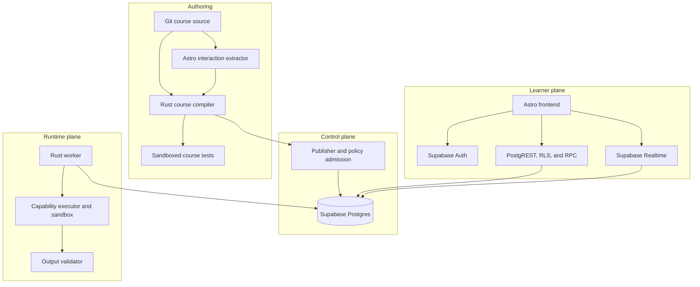

# Ainigma long-term architecture plan

This document describes the target architecture after the first course is working. It is a direction, not a requirement to implement every component before launch.

The first version remains intentionally smaller:

- Supabase Auth for GitHub login.
- Direct RLS reads and narrow PostgreSQL RPC writes.
- Realtime notifications for sanitized task-run status.
- A Rust course compiler and one Rust worker.
- One runtime capability: `generate_artifact`.
- Edge Functions only for rare synchronous external integrations.

## 1. Long-term objective

Ainigma should treat a complete course as code:

```text
Git course source
→ deterministic verification and compilation
→ immutable course bundle
→ policy admission for one environment
→ published course release
→ constrained learner runtimes
```

The compiler describes and verifies what a course requests. A trusted control plane decides what the target environment permits. Workers execute only the resulting admitted plans.

No browser, queue message, course author, or worker may invent runtime privileges outside this chain.

## 2. Authority boundaries

### Git owns course definitions

Presentation and runtime definitions may live in separate Git repositories. A public presentation repository contains MDX and learner-safe interaction contracts; a private runtime repository contains runtime TOML, builders, and runtime-only assets. Public files use logical runtime keys rather than private repository paths. A private assembly lock pins the full commits of both sources for trusted compilation.

Git contains:

- Course and task definition keys.
- Sections, ordering, routes, and MDX content.
- Runtime-aware component references.
- Challenge keys and point definitions.
- Runtime TOML.
- Output and custom-data schemas.
- Runtime resource requests.
- Pinned builder/runtime artifacts.
- Symbolic secret references, never secret values.

### PostgreSQL owns operational state

PostgreSQL contains:

- Operational course offerings and release lifecycle.
- Profiles, verified identifiers, memberships, and invitations.
- Immutable compiled task/runtime records.
- Learner runs, leases, submissions, progress, and expiry.
- Resource references and cleanup state.
- Audit events required for operation or policy.

### The platform owns permissions

Environment policy—not course code—controls:

- Allowed runtime capabilities.
- Executor implementations.
- CPU, memory, disk, PID, and duration ceilings.
- Network and egress policy.
- Allowed secret bindings.
- Provider/IAM access.
- Global and per-course capacity.
- Runtime sandbox strength.

## 3. Target architecture



The learner plane may continue using Supabase directly indefinitely. A Rust HTTP API is optional and should be introduced only when it solves a demonstrated problem.

## 4. Course compiler

The compiler is the center of the course-as-code workflow:

```text
ainigma course check
ainigma course build
ainigma course test
ainigma course diff --target <course_key>
ainigma course publish --target <course_key>
```

### `course check`

Performs static validation without side effects:

- Compile MDX.
- Validate course structure and stable keys.
- Extract registered runtime-aware components.
- Parse runtime TOML and schemas.
- Match frontend requirements to runtime outputs.
- Validate points and challenge identity.
- Reject secrets or expected answers in frontend artifacts.
- Reject mutable runtime image tags and unpinned inputs.
- Validate requested resource and network policy shape.

### `course build`

Builds immutable artifacts from the complete declared dependency closure across every pinned presentation/runtime source root:

- Course and section manifests.
- MDX and presentation assets.
- Registered component contracts.
- Runtime TOML and output schemas.
- Runtime-only assets and builders.
- Relevant lockfiles and toolchain versions.

It rejects missing or undeclared files, path-case collisions, unknown component contracts, and unpinned network-fetched inputs. Public CI may extract and validate presentation requirements without private credentials; only trusted integration CI checks out private runtime sources. The safe bundle never exposes private repository paths, commits, runtime configuration, answers, or secrets.

### `course test`

Executes representative task instances with deterministic test inputs using production-compatible executors:

1. Build or provision the task in a sandbox.
2. Validate every declared output.
3. Register and self-test every verifier.
4. Confirm expected answers succeed and incorrect answers fail.
5. Check artifact type, size, and visibility.
6. Reject undeclared outputs.
7. Run cleanup twice and require idempotent success.

Static compilation proves contract consistency; executed tests provide evidence that the runtime implementation actually works.

### `course diff`

Classifies changes before publication:

- Presentation-only course release change.
- Task interaction-contract change.
- Runtime implementation change.
- Operational offering change.
- Resource or permission change requiring policy review.

### `course publish`

Publishes only previously built artifacts, records the source commit, performs environment admission, and creates or reuses immutable database records.

## 5. Compiled artifacts and identity

Use three distinct digests:

| Digest                  | Meaning                                                   | Used by learner API?                 |
| ----------------------- | --------------------------------------------------------- | ------------------------------------ |
| `course_release_digest` | Exact safe compiled frontend/course release               | No                                   |
| `task_release_digest`   | One task interaction contract bound to one runtime digest | Yes                                  |
| `runtime_digest`        | Private generation/provisioning implementation            | Indirectly, through the task version |

A typo changes only `course_release_digest`. A runtime-aware MDX contract change also changes `task_release_digest`. A runtime definition or runtime artifact change changes all three in the newly bound course release.

Each digest hashes canonical bytes that omit their own digest field. Envelopes carry the resulting digest. Keep one Rust canonicalization implementation and golden vectors at language/database boundaries.

## 6. Runtime-aware MDX contracts

Presentation-only MDX may change freely. Runtime-aware behavior uses registered components with statically extractable literal props:

```mdx
<FlagChallenge challengeKey="investigation-flag" />
<TaskArtifact artifactKey="packet-capture" />
<TaskConnection connectionKey="terminal" />
```

Registered Astro wrappers supply immutable contracts such as `flag-challenge-v1`; React, Svelte, or other island implementations are interchangeable when they pass the same browser conformance tests. A framework-only change preserves `task_release_digest` and changes only `course_release_digest`.

One-off custom components use an explicit data contract:

```mdx
<PacketTraceViewer
  contract="packet-trace-viewer-v1"
  dataKey="primary-trace"
  schema="packet-trace-v1"
/>
```

The runtime declares the matching learner-safe output:

```toml
[[outputs]]
kind = "custom_data"
key = "primary-trace"
schema_id = "packet-trace-v1"
visibility = "learner"
```

The compiler rejects arbitrary MDX runtime/API calls, dynamic keys, unresolved prop spreads, unknown contracts, and producer/consumer schema mismatches.

Runtime-sensitive facts such as generated filenames, ports, and credentials must be rendered from typed run data rather than duplicated in prose. If important narrative semantics cannot be represented structurally, the task declares an explicit versioned `exerciseContract` included in the task interaction contract.

## 7. Authored runtime contract

A runtime definition requests constrained behavior:

```toml
runtime_schema_version = 1
capability = "generate_artifact"
executor_contract = "artifact-builder-v1"
builder_image = "registry.example/task-builder@sha256:..."
generation_secret_ref = "course-task-generation@1"

[resources]
cpu_millis = 500
memory_mb = 256
disk_mb = 512
pids = 64
timeout_seconds = 60

[network]
mode = "none"

[[outputs]]
kind = "artifact"
key = "packet-capture"
media_type = "application/vnd.tcpdump.pcap"
max_bytes = 10000000
```

This contract is a request, not an authority grant. Course code cannot grant itself unrestricted network, privileged containers, arbitrary host mounts, unknown executors, unlimited resources, or access to arbitrary secrets.

## 8. Policy admission and execution plans

The control plane compares the compiled runtime contract with target-environment policy.

Example environment policy:

```text
allowed capability: generate_artifact
allowed executor: artifact-builder-v1
maximum memory: 512 MB
maximum timeout: 120 seconds
network: none
allowed secret namespace: course-task-generation
```

If the request exceeds policy, publication fails with a clear diagnostic. Do not silently weaken the request, because the published behavior would differ from the tested behavior.

Successful admission creates an immutable execution plan:

```json
{
  "execution_plan_schema_version": 1,
  "runtime_digest": "sha256:<runtime-digest>",
  "capability": "generate_artifact",
  "executor_contract": "artifact-builder-v1",
  "builder_image": "registry.example/task-builder@sha256:...",
  "limits": {
    "cpu_millis": 500,
    "memory_mb": 256,
    "disk_mb": 512,
    "pids": 64,
    "timeout_seconds": 60
  },
  "network_policy": {
    "mode": "none"
  },
  "secret_grants": [
    {
      "binding": "course-task-generation@1",
      "purpose": "run-seed-derivation"
    }
  ],
  "outputs": [
    {
      "kind": "artifact",
      "key": "packet-capture",
      "media_type": "application/vnd.tcpdump.pcap",
      "max_bytes": 10000000
    }
  ]
}
```

A learner run pins `task_version_id`, `runtime_revision_id`, and `execution_plan_id`.

## 9. Worker trust model

A queue message carries identity, not executable policy:

```json
{
  "queue_message_schema_version": 1,
  "run_id": "01900000-0000-7000-8000-000000000000"
}
```

After acquiring a lease, the worker loads the immutable admitted plan from PostgreSQL. It never trusts runtime fields supplied by the browser or queue message.

Every worker operation must enforce:

- Current lease token and fencing generation.
- Exact task/runtime/execution-plan identity.
- Pinned builder or image digest.
- External idempotency key derived from run/deployment ID.
- Timeout and resource limits.
- Network and filesystem policy.
- Secret grants scoped to the executor and purpose.
- Declared output schemas, sizes, and visibility.
- Cleanup after failure, cancellation, or expiry.

Before marking a run ready, validate:

- Every declared challenge has a self-tested verifier.
- Every required artifact, connection, or custom-data output exists.
- No undeclared output is exposed.
- Public output contains no private resource or secret metadata.
- Artifact media types and sizes satisfy the compiled contract.

## 10. Sandbox strategy

For trusted course authors, rootless containers with strict limits may be sufficient initially:

- Read-only root filesystem.
- No privileged mode or host container socket.
- No host mounts outside an isolated workspace.
- CPU, memory, disk, PID, and timeout limits.
- Deny-by-default network policy.
- Seccomp/AppArmor or equivalent controls.

If course code or learner-controlled input is considered hostile, move appropriate capabilities to a stronger boundary such as gVisor or a microVM. The platform chooses the sandbox; course code cannot disable it.

## 11. Supabase and service evolution

### Learner plane

Keep using Supabase while it remains clear and maintainable:

- Supabase Auth for identity.
- Direct RLS reads.
- Narrow transactional RPC writes.
- Realtime notifications for sanitized run status.
- Storage policies or short-lived signed URLs.

Realtime is a notification mechanism, not durable state. Clients subscribe, fetch current state to close races, and refetch after reconnect.

### Edge Functions

Use only for short synchronous external adapters or webhooks. External work that needs durable retry belongs in a database outbox and Rust worker.

### Rust control plane

Introduce an administrative Rust service when publication/admission, quotas, provider orchestration, operator tooling, or external integrations outgrow RPCs. It may coexist with direct learner RPCs.

### Optional Rust learner API

Add a general learner-facing Rust API only when there is a demonstrated need, such as:

- RPCs becoming hard to evolve or test.
- Substantial non-transactional business logic.
- Multiple non-browser clients.
- Authorization duplicated across SQL and adapters.
- Need for custom streaming or public API contracts.

It should validate Supabase access tokens through standard JWT/JWKS middleware and reuse the same Rust domain/control-plane crates. Do not rewrite stable database invariants merely because an HTTP service exists.

## 12. Suggested Rust workspace

```text
crates/
  ainigma-course-schema/
  ainigma-course-compiler/
  ainigma-runtime-contract/
  ainigma-runtime-policy/
  ainigma-runtime-executor/
  ainigma-verifier/
  ainigma-control-plane/
  ainigma-worker/

bins/
  ainigma/
  ainigma-worker/
  ainigma-api/          # optional later
```

- `course-schema`: manifests, schema versions, canonicalization, digest types.
- `course-compiler`: check/build/test/diff/publish artifacts.
- `runtime-contract`: authored runtime schema, outputs, and requested limits.
- `runtime-policy`: environment admission and execution-plan generation.
- `runtime-executor`: sandboxed capability handlers and output validation.
- `verifier`: immutable normalizer/verifier implementations and vectors.
- `control-plane`: publication, capacity, and operator workflows.
- `worker`: leases, execution, result commit, and cleanup.
- `api`: optional HTTP adapter over the same domain services.

The Astro extractor emits a versioned interaction document consumed by the Rust compiler. Rust remains the only canonical digest implementation.

## 13. Phased adoption

### Phase 1: working course

- GitHub Auth, RLS reads, RPC writes, and Realtime status.
- Course compiler with `check` and `build`.
- One worker and `generate_artifact` capability.
- Hard-coded conservative runtime policy.
- Run-scoped verifier self-tests and cleanup.

### Phase 2: verified compilation

- `course test` using production-compatible executors.
- Complete dependency closure and reproducible artifacts.
- `course diff` classification.
- Typed custom MDX data contracts.
- Pinned runtime artifacts and stronger provenance.

### Phase 3: policy-controlled runtime

- Versioned environment policy.
- Immutable execution plans.
- Resource/capacity admission and quotas.
- Capability-specific sandbox policies.
- Operator controls for disable, retry, expiry, and cleanup.

### Phase 4: control-plane service

Introduce Rust control-plane HTTP endpoints when administrative orchestration justifies a service. Keep learner RPCs where they remain simpler.

### Phase 5: optional consolidation

- Add a learner-facing Rust API only if needed.
- Split worker pools by capability or isolation boundary.
- Add stronger sandboxing for hostile code.
- Add signed course/runtime/execution-plan provenance if the threat model requires it.

## 14. Optional signing

Hashes identify bytes but do not prove who authorized them. If stronger supply-chain protection becomes necessary, CI or the publisher signs course bundles, task bindings, runtime manifests, or admitted execution plans. Workers verify a trusted publisher signature before execution.

This is not required for the first release. Canonical manifests and digests make it possible to add later without changing authored course identity.

## 15. Long-term invariants

1. A learner run always pins an immutable task version, runtime revision, and admitted execution plan.
2. Browser and queue input never supplies executable runtime policy.
3. Course code requests capabilities; environment policy grants them.
4. Workers execute only known capability handlers and admitted plans.
5. Secret values never appear in Git, frontend bundles, queue messages, or public result rows.
6. Runtime-sensitive frontend behavior is a typed, statically extracted contract.
7. Presentation-only edits do not create runtime revisions.
8. Every external operation is leased, fenced, idempotent, and cleanable.
9. Realtime is advisory; PostgreSQL is authoritative.
10. A Rust API is an optional adapter, not a prerequisite for a secure course-as-code platform.
