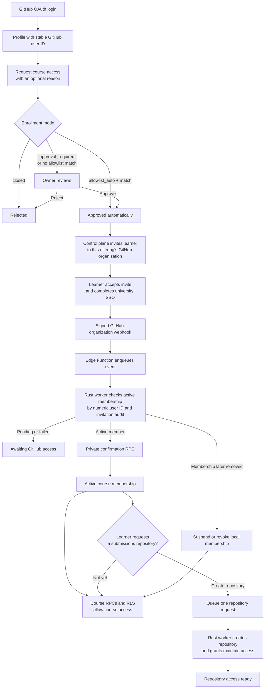

For email-domain enforcement, OAuth itself cannot require `@example.com` before login. After OAuth succeeds, the application can call:

```text
GET /user/emails
```

with the `user:email` scope. GitHub returns each address with `primary` and `verified` fields. We can accept the user only if, for example:

```text
primary == true
verified == true
domain == "example.com"
```

or allow any verified institutional address. The stricter primary-email rule is probably best. [GitHub email API](https://docs.github.com/en/rest/users/emails)



Owner approval or allowlist approval alone never grants course access. The learner must also be confirmed as a member of the course's GitHub organization.

The database maps each `course_definition_key` to its expected GitHub organization ID. An
organization may be shared by several course definitions, but the local invite/access record is
always for one offering and one profile. Confirmation rejects a membership reported for the wrong
organization. Offering-specific repositories, teams, and local memberships remain separate even
when the organization is shared.

## Control plane

A trusted Edge Function uses a GitHub App to invite by the verified email or stable GitHub user ID and accepts
signed webhooks. It durably enqueues delivery IDs for a Rust worker (future `pgmq`), which verifies
membership and calls the private confirmation/revocation RPC. After membership activation, a learner
may explicitly request a repository; a separate idempotent job provisions it. Periodic reconciliation covers
missed webhooks; no browser token is trusted.

```
GitHub webhook
  → Supabase Edge Function
  → verify signature
  → enqueue event
  → return 2xx

Rust control-plane worker
  → consume queue
  → call GitHub API
  → verify current membership/IdP state
  → call private confirmation or revocation RPC
```

In short: the Edge Function is the authenticated ingress, the queue is the durable handoff, and the Rust worker performs retries, authorization reconciliation, and GitHub provisioning. PostgreSQL remains authoritative for Ainigma membership; repository provisioning is separate from the membership transaction.

The worker keeps these workflow operations behind an external-platform adapter so a future Forgejo implementation can replace the GitHub API without changing enrollment reconciliation or durable repository jobs. See [External platform adapter](../external-platform-adapter/).

Responsibilities:

- **Edge Function:** verify webhook signatures, deduplicate deliveries, enqueue events, and optionally send invitations.
- **Queue (`pgmq` later):** provide durable handoff and retryable delivery.
- **Rust worker:** start approved invitations, call GitHub, reconcile membership, and create requested repositories and permissions.
- **PostgreSQL:** decide local access through the private confirmation/revocation RPCs.

### Manual polling before webhooks

Before the Edge Function and webhook are available, `ainigma-course-access-worker poll` starts the GitHub
invitation automatically for each approved access request that has no invitation yet. It first
adopts a matching manually sent email invitation, preserving its email target and invitation ID;
if none is pending, it sends a new invitation by the verified stable GitHub user ID. The explicit
`invite` command remains available for a targeted retry or for sending by email. The database
records the method, exact allowed target, and GitHub organization invitation ID, so the worker
can use an explicit, domain-limited email override for an approved profile. Repeating either operation is safe for an already pending or
active access record. If starting the invitation fails, the row becomes `failed`; a later targeted
`invite` command retries it without creating a second invitation when the provider already has one
pending.

The poller reads approved access records through the trusted database RPC and fetches each distinct
configured organization once per run. It batches active members and pending invitations. For
unresolved invitations it also checks `org.add_member` audit records, requiring the stored invitation
ID and stable GitHub user ID to match before confirmation. The current GitHub username comes from
the active-member response and is cached only for repository API calls. It can be run once or with
a short polling loop. Students do not need a special website auth link for this process.

The database records provider progress through `invitation_pending`, `sso_required`, and `failed`
states, including invitation/check timestamps and bounded failure codes. A successful check is the
only path that creates the local learner membership; the poller never inserts memberships itself.
Confirmation does not create a repository job. The course page first reads
`get_my_course_repository(offering_key)` and offers a button while the state is `not_requested`.
The button calls `request_my_course_repository(offering_key)`, which verifies active learner and
GitHub access and queues exactly one job for the offering and profile. Repeating either the browser
request or worker run is safe. The worker creates or reuses the private repository named
`submissions-<offering_key>-<external_user_handle>` and grants
that provider user the configured maintenance permission. A repository is bound to the offering/profile in the
database, and a name marker prevents accidentally adopting an unrelated repository. Leased jobs
and bounded exponential retry state make crashes, duplicate runs, and GitHub create races
recoverable. Permanent failures and exhausted retries become `blocked` instead of looping forever.

Only published offerings are reconciled against GitHub. Once an offering is archived, its content
release and historical membership state stop following external changes. For a published offering,
three consecutive complete member snapshots must omit an active learner before local access is
revoked; transient GitHub and SSO failures preserve the last confirmed access state.
