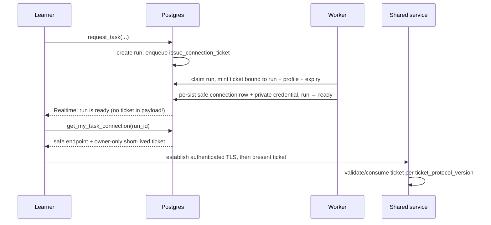

Git/MDX owns presentation, while Postgres owns authorization and runtime state.

## 0. Recommended first vertical slice

Build one complete workflow before implementing shared services:

```text
GitHub login
→ request course access
→ owner approves the request
→ view published course/task
→ request generate_artifact task
→ worker processes it
→ learner receives artifact/status
→ submit one flag
→ progress is recorded
→ run expires and cleanup succeeds
```

Use:

- one course;
- one offering;
- one worker binary;
- one capability: `generate_artifact`;
- one normalizer and verifier;
- no SAML;
- no containers or VMs;
- no shared/attached services;
- no official grade export.

Test that slice with:

- concurrent learners;
- a worker crash before persistence;
- a crash after persistence but before queue archival;
- membership revocation;
- a task release update while an old page remains open;
- expiration and cleanup;
- database plus secret restore;
- verification that no answer or secret appears in frontend artifacts or logs.

Once that works, add `provision_container`, then shared services only if a real exercise needs them.

## 1. First implementation: secure foundation

Ignore `ainigma-backend`; it is deprecated and has no compatibility requirements.

Create two schemas:

- `public`: frontend-readable data protected by RLS. Browser-callable RPCs live here because it is an exposed PostgREST schema, but direct table writes remain denied unless explicitly listed.
- `private`: authentication mappings, internal helpers, and trusted worker specifications. Never expose it through PostgREST.

Use deny-by-default privileges from the first migration:

- Revoke default table, sequence, and function privileges from `PUBLIC`, `anon`, and `authenticated` before granting the narrow operations below.
- Browser roles receive no `USAGE` or relation privileges on `private`; access to private state occurs only through explicitly granted functions.
- Functions are not executable by `PUBLIC` by default.
- Apply RLS to every browser-visible table and use `FORCE ROW LEVEL SECURITY` where ownership by a privileged migration role could otherwise cause a false sense of safety in tests.
- A browser-visible profile update uses `GRANT UPDATE (display_name)` or a narrow RPC. A row-level policy alone cannot prevent changes to other columns.

Treat copied owner, course, task, version, and deployment columns as security boundaries, not caches trusted merely because an RPC populated them. Enforce every copied authorization anchor with composite unique constraints and foreign keys. For example, `tasks` exposes `unique (id, course_id)`, `task_versions` exposes `(id, task_id, runtime_revision_id)`, `task_runs` references both tuples, and each run child references one unique parent tuple containing every copied RLS anchor. Apply the same rule to course-release task mappings and shared-service deployment references; triggers do not replace these constraints.

Create these initial tables:

### `public.profiles`

Provider-neutral application users:

- `id uuid primary key`
- `display_name`
- `created_at`
- `updated_at`

Do not store authorization-critical GitHub metadata here.
Avatars are deferred from the initial release. If added later, store a path into a private, MIME- and size-restricted Supabase Storage bucket served through short-lived signed URLs — never an arbitrary external URL or a database image blob.

### `private.auth_user_links`

Connect Supabase Auth accounts to application profiles:

- `auth_user_id → auth.users.id`
- `profile_id → public.profiles.id`
- `created_at`

A profile may have multiple Auth accounts. This lets a future verified SAML account retain the learner’s GitHub-era memberships, progress, and task ownership.

Keep the first release deliberately narrow:

- `auth_user_id` is the primary key, so one Auth user cannot belong to two profiles.
- The GitHub Auth trigger creates one profile and its initial link. It is minimal, idempotent, and performs no network calls so a provider/API outage cannot block signup.
- There is no self-service account merge or generic “link these profile IDs” RPC initially.
- Never merge profiles merely because two providers report the same email address.

When SAML is added, a separately verified SAML login can be linked to an existing profile through an administrator-assisted or dual-authenticated migration flow. Memberships, runs, and submissions continue to reference the stable application profile rather than either provider account. A second Auth account may already have triggered creation of an empty profile, so the merge workflow must lock both profiles, reject conflicting populated histories unless an explicit migration is approved, repoint the Auth link, and retire any empty orphan profile. Linking and merging are append-only audited, but that workflow is deferred until SAML implementation.

Provide an idempotent reconciliation function/job that creates any missing profile/link after an operational trigger failure and reports orphaned or duplicate state. Test the trigger and reconciliation against Auth schema upgrades; do not make successful login permanently depend on a complex trigger body.

### `private.profile_identifiers`

Store trusted identity claims used for course access checks without putting provider metadata in `public.profiles`:

- `id uuid primary key`
- `profile_id → public.profiles.id`
- `kind`: initially `email`, `external_user_id`, `external_user_handle`, or `student_identifier`
- `issuer`: for example `github.com` or the institution identifier
- `scheme_version integer`
- `normalized_value`
- `verified_at` and `last_verified_at`
- Optional `revoked_at`
- `source_auth_user_id` and provider identity ID when supplied by an Auth identity
- Timestamps

The identifier type is the tuple `(kind, issuer, scheme_version)`. In particular, a student-number type is never an unversioned generic string: use a definition such as `(student_identifier, example-university, 1)`. A change to its syntax or normalization creates version `2`; existing values are never silently reinterpreted.

The external provider's stable user ID is the authorization identity. A handle is a mutable, potentially reusable alias used only for lookup and display/audit. When an administrator imports a roster or allowlist entry using a provider handle, the trusted import path resolves it to `(external_user_id, <provider issuer>, 1, <provider-id>)` and stores that stable target. It never authorizes by handle alone.

Keep identifier history without treating stale claims as current. Enforce a partial uniqueness constraint on `(kind, issuer, scheme_version, normalized_value)` for active rows where `revoked_at is null`. Provider synchronization retires an old GitHub username alias when it changes, while the numeric GitHub ID remains stable. Normalization is implemented and tested by versioned application code; it is not supplied as executable database data.

Only trusted Auth synchronization, roster import, or an administrator workflow may create verified profile identifiers. User-editable profile or Auth metadata is never accepted as an identity claim; synchronization reads the trusted provider identity/subject data, not `raw_user_meta_data`. GitHub numeric IDs, current username aliases, and verified email claims are refreshed on authenticated provider login and by a reconciliation job. SAML attributes can later populate the same table without changing course membership ownership.

### `public.courses`

One row represents one concrete operational course offering, not a second copy of its MDX presentation:

- Database-generated stable UUID used by foreign keys
- `offering_key`: globally unique, meaningful, immutable key for this offering, such as `security-fundamentals-2026-spring`; this is the offering key passed by the frontend RPCs
- `course_definition_key`: meaningful immutable key matching the reusable Git course definition, such as `security-fundamentals`
- `code`
- `status`: `draft`, `published`, or `archived`
- `enrollment_mode`: `approval_required`, `allowlist_auto`, or `closed`
- Optional `starts_at` and `ends_at
- Optional `external_url` for public course information
- `created_at` and `updated_at`

Git contains `course_definition_key`, not an environment- or semester-specific database UUID. The course overview frontmatter declares this immutable identity explicitly; the content directory name is only a mutable definition slug and may be renamed without changing `course_definition_key`. Publisher configuration binds that definition to a target `offering_key`/UUID and emits the bound safe frontend manifest. This lets the same validated source artifact be promoted between environments or reused for a later offering without editing Git solely to replace an operational UUID.

Course title, summary, navigation label, and content ordering remain authored in Git. The frontend and instructor dashboard read them from the generated course/frontend manifest; they are not independently edited on this row.

Enrollment modes are enforced by the request RPC, not by frontend behavior:

- `approval_required`: every learner request waits for owner approval. The trusted roster/allowlist result is shown as an owner-side helper and filter only.
- `allowlist_auto`: a request matching an active trusted allowlist entry is automatically approved; a non-matching request remains in the owner queue for optional manual approval.
- `closed`: new learner requests are rejected. Existing active memberships are unaffected until explicitly suspended or revoked.

Automatic or manual approval only starts the external GitHub course-organization access workflow. It never grants course content access directly. The learner becomes active in Ainigma only after the expected stable GitHub identity is confirmed as a member of the course organization.

Changing the mode affects new or still-pending requests. It does not silently revoke existing memberships or silently approve old pending requests; those transitions require an explicit owner or reconciliation action.

### `public.course_memberships`

Provider-independent enrollment:

- `course_id`
- `profile_id`
- `role`: `owner`, `instructor`, or `learner`
- `status`: `active`, `suspended`, or `revoked`
- `created_at`
- `created_from_access_request_id`, `suspended_at`, and `revoked_at` where applicable
- A learner membership is created as `active` only after the required external GitHub course-organization access is confirmed; approval alone is not membership.
- Primary key `(course_id, profile_id)`

Role and status transitions occur only through constrained functions and an append-only audit event. Each course has exactly one active owner; it may have any number of instructors and learners. The Ainigma compiler/control plane branches an offering from an exact course-definition release and creates its initial owner in the same transaction. Ownership transfer locks the course row, atomically demotes the previous owner to instructor and promotes an existing instructor, and may not leave the course without an active owner.

GitHub organization membership will NOT control course access.

### `private.course_access_requests`

Enrollment is approval-based and externally gated. A learner opens the course URL, authenticates with GitHub, and submits an access request. The request is not a membership and does not grant course access. Only an owner may approve it; approval starts the GitHub course-organization invitation/provisioning workflow. An active learner membership is created only after GitHub confirms that the authenticated stable GitHub identity belongs to the course organization.

- `id uuid primary key`
- `course_id`
- `requester_profile_id`
- `requested_role`: initially only `learner`
- Optional `reason` supplied by the learner, retained with a bounded length
- `status`: `pending`, `approved`, `rejected`, or `cancelled`
- `requested_at`, `decided_at`, `decided_by`, and optional `decision_reason`

The requester profile is always derived from the authenticated session through `auth.uid()`; the browser never supplies a target profile ID. Enforce at most one pending request per course and requester. Repeated requests are idempotent and return the existing request or existing membership state.

The owner-facing API can list pending requests, filter them by authorization status, and approve or reject selected requests or all currently pending requests. Bulk approval locks and rechecks every request, verifies that every selected row belongs to the same course and is still pending, changes request status to approved, and enqueues or starts the external GitHub access workflow. It does not grant course content access or create an active membership before GitHub confirmation. A learner cannot approve, reject, or alter another learner's request.

A public course link is only a discovery and request URL. It is not a bearer enrollment credential. An unauthenticated visitor sees only the public course information; an authenticated user sees their membership or request state. A leaked link therefore cannot grant course access.

### `private.course_roster_allowlist`

A course may have an imported roster or allowlist from an external student system. This table is a trusted cross-check, not an authorization grant by itself:

- `id uuid primary key`
- `course_id`
- `identifier_kind`, `identifier_issuer`, and `identifier_scheme_version`
- `normalized_identifier_value`
- Optional `role`, initially `learner`
- `source` or import batch identifier for audit
- `status`: `active` or `revoked`
- `imported_at`, `imported_by`, and optional `revoked_at`

Allowlist entries use stable identifiers where possible: verified email or a trusted versioned student identifier from the external system. External authorization uses the stable `external_user_id`; a mutable provider handle is only an input alias that must be resolved before it becomes an allowlist target.

When displaying requests, the owner API compares the requester's active verified profile identifiers with active allowlist entries and returns a derived status such as:

- `preauthorized`: an exact trusted identifier match exists;
- `not_preauthorized`: the profile is known but no allowlist entry matches;
- `unverified`: the required external identifier has not yet been established for the profile.

This status is a filter and review aid. Even a `preauthorized` learner still requires owner approval in the initial implementation. The approval record should retain which allowlist source or entry justified the decision, without trusting user-editable Auth metadata. Later, a course may opt into one-click self-enrollment for preauthorized learners without changing the identity model or bypassing the GitHub course-organization gate.

Allowlist import and reconciliation are idempotent and do not create memberships automatically. A future bulk workflow may import a roster, show the preauthorized pending requests, and let the owner approve all of them in one action.

### `private.external_course_access`

A course that requires GitHub repositories has one external-access record per requested profile. Owner approval creates or updates this record and starts the GitHub organization invitation workflow; it does not grant course content access:

- `course_id`
- `profile_id`
- Stable `external_group_id` and group handle retained for diagnostics
- Stable `external_user_id`
- Current `external_user_handle` as a replaceable API-handle cache
- Exact `external_invitation_id` for acceptance correlation
- `state`: `not_started`, `invitation_pending`, `sso_required`, `active`, `failed`, or `revoked`
- `invited_at`, `last_checked_at`, `accepted_at`
- Bounded `failure_code` and provider request metadata safe for diagnostics

Only the trusted GitHub integration may change this state. When GitHub confirms active membership for
the expected stable GitHub user ID and the matching organization invitation ID appears in the audit
record, one transaction creates the learner's active `course_memberships` row and appends its
membership event. Until then, all course-content and task RPCs deny access; the learner can see only
a safe status such as `awaiting_external_access`.

The integration must reconcile invitation acceptance, SSO authorization, organization removal, and failed invitations. A later check that the user no longer belongs to the course organization suspends or revokes the local membership according to course policy. GitHub organization membership is an external access prerequisite, not a substitute for the local course membership and RLS model.

### Future personal invitations

Email invitations and personal enrollment links are deferred until the approval/request workflow demonstrates a real need for them. If added later, they must remain identity-bound: a token may identify a target, but possession of the URL alone must never authorize enrollment. Reuse by an already-enrolled target should return the existing course state; another authenticated account must be denied. There are no generic reusable bearer join codes.

### `public.tasks`

Minimal operational task identity:

- Internal stable task UUID generated or resolved by the publisher; authors do not copy this UUID into MDX
- `task_definition_key`: meaningful immutable course-local authoring key such as `packet-traces`
- `course_id`
- `status`
- Timestamps

Task title, summary, estimated duration, route, ordering, and section placement remain in MDX and the frontend manifest. Grading points and challenge weights belong to the runtime definition and are projected into immutable runtime challenge rows. Do not duplicate them in `public.tasks`.

There is no `course_sections` table initially. Astro derives sections/weeks and navigation from the content directory and section `index.mdx` frontmatter. Add an operational section table only if sections later acquire database behavior such as independent enrollment, availability windows, prerequisites, or deadlines.

Task UUIDs and task definition keys remain stable when a title, route, or presentation changes. Task definition keys use a constrained readable format such as `^[a-z][a-z0-9-]{2,63}$`. Enforce `unique (id, course_id)` and `unique (course_id, task_definition_key)`. The offering's current course-definition release—not a mutable task pointer—selects the task version.

The two identifiers serve different purposes:

- The UUID is the database identity used by foreign keys, runs, and internal APIs.
- The definition key is the human-readable identity shared by MDX, runtime TOML, validation errors, and build logs.

Definition keys are not secrets or authorization tokens. Authorization always checks the authenticated profile, course-scoped task, owned run, pinned task/runtime version, and relational challenge key.

### `private.task_versions`

A task version is the immutable binding the browser API relies on. It pairs one extracted frontend interaction contract with one runtime revision; it is not a snapshot of all MDX prose.

- `id uuid primary key`
- `task_id → public.tasks.id`
- `runtime_revision_id → private.runtime_revisions.id`
- Per-task `revision`, assigned while the publisher locks the task
- `interaction_schema_version`
- Safe validated `interaction_spec jsonb`
- Exact canonical binding-manifest bytes
- `task_release_digest`, computed from those bytes
- Lifecycle: `validated`, `preparing`, `launchable`, `disabled`, or `retired`
- Timestamps

The binding manifest contains the task definition key, interaction schema/versioned component contracts, runtime-aware keys and schemas, and the pinned `runtime_digest`. It excludes titles, prose, ordering, CSS, and presentation-only assets.

Add unique tuples `(id, task_id)`, `(id, task_id, runtime_revision_id)`, `(id, task_id, task_release_digest)`, and `unique (task_id, task_release_digest)`. Enforce `(runtime_revision_id, task_id) → runtime_revisions(id, task_id)`. These keys support course-release and run references without trusting publisher code.

A typo or presentation-only frontend change reuses the same task version. `disabled` rejects new runs; `retired` means no supported course release or nonterminal run still references the version.

### `private.runtime_revisions`

A runtime revision is the reusable, immutable generation/provisioning contract:

- `id uuid primary key`
- `task_id → public.tasks.id`
- `runtime_digest`, unique with `task_id`
- Unique `(id, task_id)` for composite references from task versions
- `runtime_schema_version` and capability projections
- Validated `runtime_spec jsonb`
- Exact runtime-definition and runtime-only asset hashes
- Pinned builder artifact/Nix closure or OCI image digest and versioned provider/executor contract identifiers
- Immutable symbolic generation-secret reference
- Source repository, commit, path, and audit metadata

The `runtime_digest` includes every input that may change generation, verifier registration, provisioning, or a shared service, and excludes frontend presentation. A runtime-affecting change creates a runtime revision and task version because `task_release_digest` pins the runtime digest. A frontend-only course release reuses both.

`runtime_schema_version` and capability are indexed projections extracted from the validated `runtime_spec`, not independently authored values. Publication rejects a mismatch between a projection and the JSON document. Executor/provider contract identifiers have immutable semantics like normalizer IDs: behavior changes receive a new ID, workers advertise only contracts they pass conformance tests for, and old implementations remain deployable until no active runtime revision requires them. Secret references must name immutable secret-manager versions; aliases whose value can be overwritten are forbidden. Deletion protection and backup policy retain each referenced generation secret for at least the lifetime of every run and retry that depends on it.

### `private.runtime_revision_challenges`

Project the security-critical challenge contract out of JSON during publication:

- `runtime_revision_id → private.runtime_revisions.id`
- `challenge_key`
- `points`
- `normalizer_id`
- `verifier_id`
- Any bounded answer-length and attempt-limit projections needed by the submission path
- Primary key `(runtime_revision_id, challenge_key)`

The original JSON remains the immutable authoring/audit projection, but verifier registration and submission use this relational table rather than traversing JSON in the hot path. Publication verifies the rows exactly match `runtime_spec`, that points sum to the declared total, and that their key set equals the safe manifest key set.

A challenge key may be reused across task versions only when it retains the same pedagogical and scoring identity. In the initial grading model, its point value is immutable within a task; changing points or meaning requires a new challenge key.

### Shared-service runtime and release integrity

`provision_shared_service` represents one long-lived deployment shared by learner runs for a runtime revision. Frontend-only course releases reuse it. Its defining dimensions remain explicit runtime fields rather than being encoded into more capability names:

```toml
runtime_schema_version = 1
capability = "provision_shared_service"
instance_scope = "runtime_revision"
management_mode = "managed" # or "attached"
runtime = "container"
transport = "tcp"
transport_security = "tls"
interaction = "stdio"
access = "connection_ticket"
ticket_protocol_version = 1
ticket_presentation = "first_line"
ticket_ttl_seconds = 900
max_connections_per_ticket = 1
```

The initial release rejects learner-facing plaintext bearer-ticket transport. A ticket is presented only inside TLS or an equivalently authenticated encrypted transport, and the issued connection metadata contains the server identity/fingerprint needed by the client. The ticket protocol specifies issuance, one-time/replay behavior, revocation, service authentication to the control plane, and clock-skew handling rather than treating `first_line` as the entire security design.

In `managed` mode, the deployment worker creates and owns the service. In `attached` mode, an operator selects an environment-allowlisted attachment target through the restricted control plane and the worker validates its resolved destination and TLS identity before use. Attachment is only a mode on the same deployment model, not a second capability, table, or queue. Both modes use the same deployment row, periodic health checks, ticket issuer, and learner flow. `issue_connection_ticket` is a separate per-learner operation that grants temporary access to that existing service; it is not a task capability.

Task versions and runtime revisions contain symbolic immutable secret references, never secret values, plaintext answers, or release-scoped expected-answer digests. Existing runs remain pinned to their original task version and runtime revision.

Immutable specifications and canonical binding-manifest bytes cannot be updated or deleted. Column privileges plus an immutable-column trigger enforce this; constrained publisher functions alone change lifecycle metadata.

Separate database roles by responsibility:

- Publisher/control-plane: inserts validated runtime revisions and task versions and activates course releases through constrained functions.
- Worker: leases work and reads/commits only through capability-specific functions. It receives the runtime fields needed for the leased target but has no general `INSERT`, `UPDATE`, or unrestricted `SELECT` privilege on private runtime tables.
- Browser roles: cannot publish definitions or access private specifications.

A compromised provisioning worker must not be able to replace trusted task definitions. Every worker commit includes the current lease token and fencing generation. After building a task, the worker commits run outputs and answer verification material before archiving—not deleting—the PGMQ message.

### Version terminology

Keep compatibility versions explicit; do not use an unqualified `schema_version` field:

- A **runtime revision** is one immutable generation/provisioning contract and its runtime-only assets, identified by `runtime_digest`.
- A **task version** is one immutable interaction-contract/runtime binding. Its `task_release_digest` is embedded in the frontend and passed to `request_task`.
- A **course release** is one exact frontend deployment, identified by `course_release_digest`, and maps each page to a task version. A typo creates a course release, not a task version.
- `runtime_schema_version` identifies the shape and semantics of `runtime_spec`. It changes only when the Rust/publisher/worker contract changes, not for an ordinary task edit.
- `interaction_schema_version` identifies the canonical task-binding/interaction envelope.
- `frontend_manifest_schema_version` identifies the safe Astro deployment manifest.
- `queue_message_schema_version` identifies a PGMQ message envelope. It can evolve independently for rolling worker upgrades.
- `ticket_protocol_version` identifies how a shared service validates and consumes a connection ticket.
- IDs such as `run-hkdf-v1`, `hmac-sha256-v1`, and `exact-v1` name immutable algorithm semantics. Their version suffix replaces separate derivation, verifier, and normalization-version columns.
- `generation_secret_ref` and `pepper_key_id` identify immutable key material; they are key references, not schema versions.
- Supabase migration timestamps/versions identify database migrations and are unrelated to task releases or message formats.

Most prose and presentation edits create only a new course release/content digest. Runtime-aware contract edits create a task version. Runtime-affecting edits create both a runtime revision and task version. Manually attaching a deployment is operational state, not a version.

### Learner-specific task instances

A task version is a shared definition, not a learner's generated task. Every accepted task initialization creates, or idempotently returns, a separately owned `task_run`, and every graded challenge stores verifier material scoped to that run. The platform does not store a task-version-wide expected answer.

For online tasks, `run_id` is the opaque generation-context identifier passed to the Rust generator together with the pinned task version and runtime revision. Generated seeds, flags, expected answers, artifacts, resource handles, and connection tickets must remain attributable to that run and therefore to its original learner. Different run IDs must produce different security-relevant challenge values. A shared-service capability may share the backing process only; its ticket, logical challenge context, and verifier rows remain run-specific.

The graded output space must be large enough to make accidental reuse negligible. A builder may use a small repeated pedagogical value internally, but the final graded answer must incorporate a run-specific high-entropy value; it must not choose the final answer from a short shared list and merely assume that learners receive different entries.

When the graded output is a flag, the Rust generator may retain a stable readable task/challenge prefix followed by the high-entropy run-specific suffix. The prefix is diagnostic presentation only: Postgres associates and authorizes the answer through `run_id` and `challenge_key`, never by parsing or trusting the flag prefix.

Initial online generation uses a domain-separated deterministic scheme such as `run-hkdf-v1`, with inputs including the secret resolved by the pinned generation-secret reference, `task_version_id`, `run_id`, and each `challenge_key`. The same run is reproducible after a worker crash, while another run receives different values. If truly random online generation is added later, its seed must be persisted durably before provisioning so retries cannot silently generate a different task.

This preserves the task-generation crate's high-level model without coupling Postgres to its internals. A future Moodle export can use an opaque export-recipient or variant ID as its generation context and embed its answers in the exported exam; it must not introduce a shared task-version verifier into the online runtime schema.

## 2. GitHub authentication and RLS

Update `supabase/config.toml` to:

- Enable GitHub OAuth using environment variables.
- Disable email, phone, password, and anonymous registration.
- Keep OAuth signup enabled.
- Use Astro’s actual development URL for redirects.

The initial release is GitHub-only. Do not assume that a GitHub social-only account can use email OTP. If email fallback is introduced later, enable it as an explicit additional identity provider, require a verified email identity, and call `signInWithOtp` with `shouldCreateUser: false`.

Add private authorization helpers:

- `private.current_profile_id()`
- `private.has_course_role(course_id, roles[])`
- `private.can_view_profile(profile_id)`

RLS rules:

- Anonymous users cannot read application tables.
- Learners can read their profile, membership, enrolled published courses, and operational task identities.
- Owners and instructors can additionally read drafts and their course roster.
- Users can update only their own display name.
- Browser users cannot insert or modify courses, memberships, access requests, roster allowlists, tasks, or task versions directly. Learners submit access requests through an RPC; owner approval starts external GitHub access, and only confirmed GitHub course-organization membership permits an active local membership.
- Owners use narrowly scoped RPCs to list and approve/reject requests, including selected-row or approve-all actions. Request results include a derived preauthorization status from the trusted roster allowlist.
- Browser roles have no access to the `private` schema.
- Authorization never trusts a user ID supplied by the frontend. Always derive user based on the token.
- During the configured retention window, learners can read their own plaintext submission history and course owners/instructors can read plaintext submissions for their course. After purge, both use the durable non-plaintext grading history.
- Instructors do not receive `SELECT` access to expected answers or other private verifier material.

### RLS scope and limitations

RLS answers which rows a caller may select or modify. It does not replace constraints, transactional RPCs, rate limits, release validation, or worker authorization:

- RLS is row-level, not field-level. Expected answers and private runtime data stay in separate private tables.
- `service_role`, superusers, table owners, and roles with `BYPASSRLS` can bypass policies. Never expose those credentials to the browser, and do not give them to a general-purpose worker.
- Views created by privileged owners may bypass underlying policies. Every browser-readable view must use `security_invoker = true` or remain inaccessible to browser roles.
- User-editable Auth metadata is never an authorization source. Course roles are read from `course_memberships`; JWT claims may also be stale until refresh.
- RLS does not audit `SELECT`. If recording which instructor viewed submissions becomes a requirement, revoke direct instructor reads and expose an RPC that writes a read-audit event before returning rows.
- Transactional per-run attempt limits do not protect PostgREST or Postgres from connection floods. Apply gateway/account/IP rate limits and request-size limits before the RPC in addition to concurrency-safe database limits.
- Foreign-key and uniqueness errors can reveal that hidden rows exist. Browser writes therefore go through narrow RPCs that return controlled errors rather than arbitrary table inserts.
- Cross-table policy checks can be slow and have concurrency races. Keep policies simple, index their owner/course columns, and enforce state transitions inside a transaction with constraints and appropriate row locks.
- A Rust worker connected directly to Postgres has no Supabase end-user JWT context. Authorize it with a dedicated least-privilege SQL role, explicit grants, and worker lease functions rather than `auth.uid()` policies.

Pure helpers that need no privilege elevation default to `security invoker`. Helpers that must read `private` state on behalf of a browser caller are explicitly `security definer`; in particular, `private.current_profile_id()` must be a small stable security-definer function because browser roles cannot read `private.auth_user_links`. `has_course_role` and `can_view_profile` are also security-definer when necessary to avoid inaccessible private data or recursive RLS evaluation.

Every security-definer function is owned by a dedicated non-login function-owner role with only the required privileges, sets an empty/fixed `search_path`, fully qualifies every relation, derives caller identity internally, validates `auth.uid()` is non-null, and has `EXECUTE` revoked from roles that do not need it. Browser-callable wrappers live in the exposed `public` schema; internal helpers remain in the unexposed `private` schema. Tests exercise them through real authenticated/anonymous JWT contexts, not only as a table-owning migration role.

Public course URLs may expose only intentionally public course metadata and the access-request entry point. Course MDX/content, task definitions, task generation, results, submissions, and progress require confirmed GitHub course-organization access. Astro must serve protected course content through SSR or another authenticated server boundary.

## 3. Authoring and publishing

Git owns presentation and trusted runtime definitions; they may live in separate repositories. PostgreSQL owns published bindings and operational state.

### Source of truth

| Data                                                                                                      | Source             |
| --------------------------------------------------------------------------------------------------------- | ------------------ |
| Prose, title, route, order, labels, hints, and presentation assets                                        | MDX/frontend files |
| Points, verifier/normalizer IDs, generation, provisioning, output schemas, and symbolic secret references | Runtime TOML       |
| Offering, membership, release, run, submission, and expiry state                                          | PostgreSQL         |

The presentation repository may be public while runtime TOML, builders, and runtime-only assets remain private. Public MDX refers to a logical key such as `runtimeContract: packet-traces`, never a private repository path; the private definition declares the matching task key. Trusted compilation pins the full presentation and runtime commits, while the safe course bundle exposes no private source path, configuration, credential, answer, or secret value. Runtime-sensitive values such as generated filenames, ports, and credentials are rendered from typed run data rather than repeated in prose.

### Course compiler

A course is published only from compiler output; the publisher never scans an ad hoc checkout. One environment-neutral course manifest names the `course_definition_key`, sections, tasks, logical runtime contracts, and source roots. The target deployment supplies the operational `offering_key`.

The CLI workflow is:

```text
ainigma course check
ainigma course build
ainigma course diff --target <offering_key>
ainigma course publish --target <offering_key>
```

`check` validates without side effects. `build` creates an immutable course bundle. `diff` shows content, interaction, runtime, and operational changes before publication. `publish` accepts only a previously built bundle and privately records every pinned source commit.

Across all pinned source roots, the compiler computes the complete declared dependency closure: course/section manifests, MDX, registered component contracts, schemas, public assets, runtime TOML, runtime-only assets/builders, and relevant lockfiles/toolchain versions. It rejects missing or undeclared files, path-case collisions, mutable runtime image tags, unknown component contracts, and unpinned network-fetched inputs.

The safe course bundle is the only input to Astro and contains presentation plus task release digests. Private runtime manifests are separate publisher/worker inputs. Learner, membership, secret values, generated answers, and run state are never course-bundle data.

### Digest rule

| Change                                                                | `course_release_digest` | `task_release_digest` | `runtime_digest` | New task version? |
| --------------------------------------------------------------------- | ----------------------- | --------------------- | ---------------- | ----------------- |
| Typo, prose, layout, CSS, presentation-only activity/component change | Changes                 | Same                  | Same             | No                |
| Runtime-aware MDX contract change                                     | Changes                 | Changes               | Same             | Yes               |
| Runtime definition or runtime asset/builder change                    | Changes                 | Changes               | Changes          | Yes               |

The browser sends only `task_release_digest` to `request_task`. It selects the exact interaction/runtime binding. `course_release_digest` identifies what was rendered and is used only by the course/frontend release record.

### Runtime-aware MDX

MDX may use ordinary presentation freely. Anything that reads or writes runtime state must use a registered component with literal, statically extractable props:

```mdx
<FlagChallenge challengeKey="investigation-flag" />
<TaskArtifact artifactKey="packet-capture" />
<TaskConnection connectionKey="terminal" />
```

Registered Astro wrappers define immutable contracts such as `flag-challenge-v1`; their internal island may use React, Svelte, or another framework. A framework change that preserves the wrapper contract changes only `course_release_digest`; shared browser conformance tests verify each implementation. The extractor writes the wrapper contract into `interaction_spec`. A challenge key is always included; an `activityKey` is included only when API/runtime state uses it.

One-off custom MDX uses the same rule rather than fetching arbitrary worker JSON:

```mdx
<PacketTraceViewer
  contract="packet-trace-viewer-v1"
  dataKey="primary-trace"
  schema="packet-trace-v1"
/>
```

The runtime declares the matching learner-safe output:

```toml
[[outputs]]
kind = "custom_data"
key = "primary-trace"
schema_id = "packet-trace-v1"
visibility = "learner"
```

CI rejects unknown components, dynamic keys, unresolved prop spreads, schema mismatches, direct MDX API calls, and runtime outputs not requested by the page. Component contract IDs have immutable semantics; incompatible behavior uses a new ID. If important narrative semantics cannot be expressed through typed components, frontmatter supplies an explicit `exerciseContract` such as `packet-investigation-v2`, which is included in `interaction_spec`.

Challenge keys are readable, unique within a task, and shared by MDX, runtime configuration, verifier rows, and submission RPCs. Reusing a challenge key preserves its pedagogical meaning and point value; otherwise use a new key.

### Build outputs

The Rust release library and Astro integration produce three artifacts:

1. A private normalized runtime manifest and `runtime_digest`.
2. Canonical task-binding bytes containing `interaction_schema_version`, task key, extracted `interaction_spec`, and the exact runtime digest; their SHA-256 is `task_release_digest`.
3. A safe bound frontend manifest containing the operational `offering_key`, presentation metadata, hashes of MDX/public assets and the frontend bundle, and each task's `task_release_digest`. Hashing its canonical payload produces `course_release_digest`, which is then stored in the manifest envelope.

`course_release_digest` identifies the exact safe Astro deployment. `task_release_digest` deliberately excludes raw MDX prose and presentation-only assets. Astro never reads the private runtime manifest and never computes either task/runtime digest independently.

A canonical task-binding payload is intentionally small:

```json
{
  "interaction_schema_version": 1,
  "task_key": "packet-traces",
  "runtime_digest": "sha256:<runtime-digest>",
  "challenges": [
    {
      "key": "investigation-flag",
      "component_contract": "flag-challenge-v1",
      "points": 4
    }
  ],
  "artifacts": [],
  "connections": [],
  "custom_data": [
    {
      "key": "primary-trace",
      "component_contract": "packet-trace-viewer-v1",
      "schema_id": "packet-trace-v1"
    }
  ],
  "server_activities": []
}
```

Its canonical bytes hash to `task_release_digest`. Correcting prose leaves this payload unchanged.

CI must:

1. Compile MDX and extract registered interaction requirements.
2. Parse runtime TOML and project its challenge/output contracts.
3. Verify task keys, challenge keys, component contracts, points, artifacts, connections, custom-data schemas, and optional exercise contract agree.
4. Reject plaintext answers/secrets and pin every runtime-affecting builder or asset.
5. Compute the three artifacts above and validate worker schema/capability support.

The current `challenges.json` may temporarily retain labels and placeholders, but no answer. Safe presentation should move beside MDX; grading and output contracts move to runtime TOML.

### Course-definition releases

`private.course_definition_releases` records one exact compiler output from the single living source
directory:

- `id`, `course_definition_key`, presentation source commit, `course_release_digest`, and immutable
  artifact reference
- Creation timestamp; release rows are immutable
- Unique `(course_definition_key, course_release_digest)`

Each operational offering stores `course_definition_release_id`. Publishing a new release advances
that pointer for non-archived offerings using the same `course_definition_key`. Archived offerings
retain their existing pointer. The Ainigma compiler branches a new offering from an explicitly
selected current release and creates a separate operational space and membership set; it never
copies the source directory.

`private.course_definition_release_tasks` maps a definition release to its task versions and
`task_release_digest` values with composite foreign keys proving the definition, task, version, and
digest agree. `request_task` resolves versions through the requesting offering's exact definition
release. A typo creates a new definition release but reuses the same task version and
`task_release_digest`.

### Database publication boundary

PostgreSQL does not compile MDX or inspect Git. Constrained publisher functions:

- Hash and schema-check canonical task-binding bytes.
- Insert or reuse the runtime revision by `(task_id, runtime_digest)`.
- Insert or reuse the task version by `(task_id, task_release_digest)` and verify its interaction/runtime projections.
- Project runtime challenges relationally.
- Create the course-definition release and its composite-FK task mapping.
- Advance non-archived offerings or branch a new offering only through compiler/control-plane
  operations.

Repository-wide validation remains in Rust/CI. Database constraints enforce persisted identity, ownership, immutability, and lifecycle transitions.

### Publication flow

1. Build and validate the runtime, binding, and frontend artifacts.
2. Insert or reuse the runtime revision.
3. Insert or reuse the task version. For a presentation-only change, runtime and task publication are no-ops; continue with the new frontend course-definition release.
4. Ensure required workers and any shared runtime deployment are ready; learner requests never provision a replacement shared service.
5. Build/upload the bound Astro artifact and register the immutable course-definition release with
   its `course_release_digest` and task mappings.
6. Mark task versions launchable and advance all non-archived offerings of that definition.
7. When creating a cohort, have the compiler branch its new offering from the selected current
   release. Retire task/runtime versions only after no offering or nonterminal run references them.

Each task page embeds only `offering_key`, `taskKey`, and `task_release_digest`. The worker attempt records its build ID for diagnostics, but a generic worker binary hash is not part of the frontend contract.

## 4. Runtime schema: second stage

Add these tables after the foundation is stable:

### `public.task_runs`

Authoritative user-visible run data:

- `owner_profile_id`, derived from the authenticated session
- `course_id`, copied from the task as an immutable RLS/authorization anchor
- `task_id`, immutable `task_version_id`, and immutable `runtime_revision_id`
- Optional `shared_service_deployment_id`, assigned only for a matching shared-service runtime revision
- `request_idempotency_key` and `request_payload_digest`
- Execution lifecycle status
- Separate cleanup status
- Expiration time
- Sanitized result metadata
- Timestamps

The copied anchors are deliberate internal denormalization. They are assigned by `request_task`, cannot be supplied or changed by the browser, and keep run/submission policies from joining through several tables on every query. Composite foreign keys prove `(task_id, course_id)`, `(task_version_id, task_id, runtime_revision_id)`, and any `(shared_service_deployment_id, runtime_revision_id)` pair agree. Expose a unique run tuple containing `id`, owner, course, task, task version, and runtime revision so every child that copies those values can reference them as one unit.

Scope request idempotency to the authenticated profile and operation. Keys have a bounded representation, such as UUID, and `unique (owner_profile_id, request_idempotency_key)`. Retrying the same key and payload returns the original run; reusing it with a different course/task/release payload returns `idempotency_conflict`. Retain the key at least as long as a client may safely retry.

Apply the same rule to other frontend-visible run children, such as artifacts: copy only the immutable owner/course authorization anchors needed by RLS, derive them from the parent run in trusted SQL, prevent browser mutation, and enforce their equality with a composite parent foreign key.

Keep execution and cleanup state separate:

```text
execution_status:
  queued → provisioning → ready
  queued/provisioning/ready → stop_requested
  queued/provisioning/ready/stop_requested → failed or expired

cleanup_status:
  not_required → pending → in_progress → succeeded
  pending/in_progress → failed → pending
```

All transitions are performed by functions that check the allowed previous state. A run is fully terminal only when execution is terminal and cleanup is `not_required` or `succeeded`. The partial uniqueness rule for one active run per learner/task includes any run that is executing or still has incomplete cleanup, unless an explicit privileged incident-recovery override permits replacement.

### `private.task_run_runtime`

Worker-only state:

- Lease owner and unguessable lease token
- Monotonically increasing fencing generation
- Lease expiration, based on database time
- Queue name and message ID
- Attempt count
- Internal errors
- Provider/resource metadata references
- Worker build ID and executor-contract version used for the attempt
- Worker heartbeat

Every heartbeat and commit matches both the lease token and fencing generation and verifies the expected run state. A stale worker therefore cannot mark a run ready after expiration, cancellation, or lease takeover. External operations use the run/deployment ID as an idempotency key and provider tag; after an uncertain outcome, retry logic searches by that tag before creating anything new.

### `private.shared_service_deployments`

Runtime-revision-scoped state for a service that is provisioned once and shared by many task versions and learner runs:

- `id uuid primary key`
- `runtime_revision_id → private.runtime_revisions.id`, unique
- `management_mode`: `managed` or `attached`, copied from the immutable runtime specification
- Lifecycle: `awaiting_attachment`, `queued`, `provisioning`, `validating`, `ready`, `degraded`, `retiring`, `retired`, or `failed`; impossible mode/state pairs are rejected
- Worker lease token, fencing generation, attempt count, heartbeat, worker build ID, and queue message metadata
- Provider/resource identifiers and private endpoint metadata
- For attached services, an environment-managed `attachment_target_id`, operator `external_reference`, actor, attachment time, and detachment time
- Attachment idempotency key and payload digest, scoped to the runtime revision
- `created_at`, `ready_at`, `retired_at`, last health-check time, next health-check time, and failure metadata

The deployment has no learner owner and is not cleaned up when an individual run or frontend course release expires. It is retired only when no supported task version or nonterminal run uses its runtime revision. A managed service's external idempotency key is the deployment ID. An attached service is never created or destroyed by the platform; the worker only validates it, issues/revokes tickets, and detaches database state.

Only the control plane may select or change an attached target, and only a worker holding the current deployment lease/fencing generation may mark it `ready`. Raw arbitrary host/port input is not accepted by the attachment RPC. The target resolves through an environment-specific allowlist whose egress policy, DNS/IP ranges, port, and server identity are validated so health checking cannot become an internal-network probe or DNS-rebinding path. The initial API rejects replacement while the deployment is `ready`; drain tickets and transition it out of service first. Every attach/detach attempt and state transition records actor, target reference, reason, and timestamp in the append-only lifecycle audit stream.

A scheduler performs periodic health checks after readiness. Failed checks move the deployment to `degraded`, stop new ticket issuance, and trigger bounded revalidation/recovery; they do not silently provision an unrelated replacement from a learner request.



### `public.task_run_connections` and private credentials

`public.task_run_connections` contains only safe status and endpoint metadata for one learner run:

- `run_id → public.task_runs.id` as the primary key
- Server-derived `profile_id`, `course_id`, task version, and runtime revision anchors, enforced by one composite foreign key to the run
- Safe host, port, transport, transport-security, server-identity/fingerprint, and interaction metadata
- `issued_at`, `expires_at`, and `revoked_at`

The plaintext short-lived ticket lives separately in `private.task_run_connection_credentials`, keyed by `run_id`. The owner retrieves safe metadata plus the credential through a narrow security-definer `get_my_task_connection(run_id)` RPC that rechecks run ownership, membership, status, and expiry. Course staff read only the safe public row under RLS; no staff policy or security-invoker view can accidentally expose a credential column because that column is not present in the public table.

Neither connection table is added to the generic Postgres Changes Realtime publication. A dedicated sanitized broadcast announces only run status. Tickets must not appear in Realtime payloads, PostgREST/database parameter logs, traces, error reports, or general task-run result metadata, and expired/revoked ticket plaintext is cleared by cleanup. Verify these logging properties against hosted Supabase rather than assuming application-level redaction is sufficient.

### Other runtime tables

- `private.task_run_verifiers`: keyed expected-answer digests scoped to one learner run
- `private.shared_service_deployments`: one active deployment per shared-service runtime revision
- `public.task_run_connections`: safe endpoint/status metadata plus a separate owner-only private credential row
- `public.task_submissions`: append-only plaintext learner attempts and their original verdicts
- `public.grading_events`: append-only non-plaintext award/revoke/restore events that remain after raw submission retention expires
- `public.challenge_progress`: current first-correct gradebook projection derived from grading events
- `public.task_artifacts`: safe downloadable-file metadata; the files themselves live in a private Storage bucket whose policies scope downloads to the run owner (or short-lived signed URLs) — Storage authorization is separate from table RLS and must be tested independently
- `private.external_resources`: external infrastructure handles and cleanup state with nullable `run_id` and `shared_service_deployment_id` foreign keys plus an exactly-one-target check. `target_kind` may be generated for message routing, but an unenforced polymorphic `(target_kind, target_id)` pair is not the integrity model. Include `provider_kind` and a provider-metadata schema version.
- Append-only lifecycle events for operational auditing, with typed actor, correlation/idempotency ID, reason, redacted metadata, and a defined retention policy

### `private.task_run_verifiers`

Every graded challenge has exactly one private verifier row for its learner run:

- `run_id → public.task_runs.id`
- Server-derived `task_version_id` and `runtime_revision_id`, copied from the run for integrity and audit
- `challenge_key`
- `expected_digest`
- `normalizer_id`, such as `exact-v1`, copied from the pinned runtime-revision challenge row
- `verifier_id`, initially `hmac-sha256-v1`, copied from the pinned runtime-revision challenge row
- `pepper_key_id`, identifying the exact Vault key used to create the digest
- `self_tested_at` and `created_at`
- Primary key `(run_id, challenge_key)`

A composite foreign key to the run proves the copied task/runtime version anchors agree, and a composite foreign key to `runtime_revision_challenges` proves the challenge belongs to that pinned runtime contract.

There is deliberately no task-version verifier table. A uniqueness constraint on `(task_version_id, challenge_key, pepper_key_id, expected_digest)` provides defense in depth against accidentally issuing the same answer to two runs while the same pepper is active. The generation scheme remains responsible for producing high-entropy run-specific values.

Verifier rows live only as long as their run can accept submissions. Cleanup deletes a run's verifier rows once the run is fully terminal; immutable submission outcomes and grading events remain the durable audit trail, while raw plaintext follows its shorter retention policy. This bounds pepper-key lifetime: rotation introduces a new `pepper_key_id` for new verifier rows, and an old pepper is retired once its last referencing verifier row is deleted. If institutional policy requires regenerating an expected answer during an appeal, retain the referenced generation secret through that appeal window even though the database pepper can retire.

### `public.task_submissions`

Every learner answer attempt is retained temporarily as an immutable plaintext audit record:

- `id uuid primary key`
- `run_id → public.task_runs.id`
- `profile_id → public.profiles.id`, derived by the RPC rather than accepted from the browser
- `course_id → public.courses.id`, copied from the run as an immutable authorization anchor
- `task_id`, `task_version_id`, and `runtime_revision_id`, copied from the run for durable audit context
- `challenge_key`
- `submitted_answer text`: the exact learner input
- `normalized_answer text`: optional plaintext value actually compared by the verifier
- `normalizer_id`
- Original `verdict`: `correct`, `incorrect`, `invalid_format`, or `verifier_error`
- `verifier_id`
- `idempotency_key` and `request_payload_digest`
- `submitted_at timestamptz not null default clock_timestamp()`

A single composite foreign key to the unique run tuple proves all copied owner/course/task/version anchors agree. Table constraints bound answer and idempotency-key lengths even though the RPC also rejects oversized input.

Submissions are inserted only by `submit_task_answer`, never directly by the browser. The exact answer, normalized answer, original verdict, and timestamp are written in the same transaction as verification. A unique constraint on `(profile_id, run_id, challenge_key, idempotency_key)` makes a retried HTTP request return its existing verdict. Reusing the key with a different answer or challenge payload returns `idempotency_conflict` rather than silently treating different work as a retry.

Learners may select their own submissions. Course owners and instructors may select submissions for their course, including learner, task, challenge key, exact answer, verdict, and timestamp. No learner or course staff role may update or delete an attempt. Set a concrete retention period per course before launch — for example, course end plus the institution's grading appeal window — and store the resulting purge deadline. Plaintext free-text learner input is personal data and is deleted in bounded retention batches after that deadline; durable non-plaintext grading events survive the purge.

Index at least `(profile_id, submitted_at)`, `(course_id, submitted_at)`, `(purge_after, submitted_at)`, and `(run_id, challenge_key, submitted_at)`. Time partitioning is optional initially but should be introduced before retention deletes become large table scans. RLS checks the server-derived `profile_id` or `course_id` directly.

`public` means exposed through the Data API under RLS; it does not mean anonymously readable. Plaintext submissions must not also be copied into PostgREST/database parameter logs, application logs, worker traces, Realtime payloads, or error-monitoring services. Verify redaction in the deployed Supabase path.

### `public.grading_events` and `public.challenge_progress`

`public.grading_events` is the durable, append-only, non-plaintext grading authority. The first correct submission inserts an `award` event in the same transaction. A narrowly authorized course-staff regrade function may later append a `revoke` or `restore` event with actor, reason, source task/run/version/challenge context, and optional source-submission UUID; it never edits the original submission. The source UUID is audit context rather than a restrictive foreign key that would block retention deletion. Events retain no submitted or expected answer and survive raw-submission purging.

`public.challenge_progress` is the current projection of those events:

- `profile_id`, `course_id`, and `task_id`, server-derived authorization anchors
- `challenge_key`
- `points_awarded`, whose value is stable for that task/challenge key under the initial model
- `run_id`, source task version, and first/effective grading-event IDs for audit
- `completed_at`
- Primary key `(profile_id, task_id, challenge_key)`

The primary key makes awarding idempotent across submission retries and replacement runs: a learner earns each stable challenge once per task. The projection can always be rebuilt from `grading_events`; it can also be cross-checked against raw submissions while they remain inside the appeal/retention window. After raw answers are purged, grading events—not deleted submissions—are the durable source. Learners read their own rows/events; course staff read rows/events for their course; browser roles cannot insert or modify either. Per-task and per-course gradebook totals are security-invoker views or RPCs that aggregate the projection.

### Run-scoped answer verification

Expected answers are never persisted in plaintext as release or verifier data: verifier rows hold only keyed digests. A learner's submitted plaintext is retained temporarily in the append-only submission table and then purged under the course retention policy. Every graded answer is generated for one learner run and registered in `private.task_run_verifiers`. Standard flag and short-answer validation runs entirely inside one PostgreSQL RPC transaction:

- Load the immutable points, `normalizer_id`, and `verifier_id` from the run's pinned relational runtime-revision challenge.
- Normalize with that finite, explicitly versioned algorithm.
- Compute a keyed HMAC using `pgcrypto` and the `pepper_key_id` held in Supabase Vault, not an ordinary table.
- Store only the expected digest and its run/challenge context.
- Retain each pepper key while any verifier row still references it; terminal-run cleanup deletes verifier rows, so an old pepper becomes retirable once unreferenced.
- Compare fixed-length digests with a reviewed timing-resistant helper, insert the plaintext submission audit row, append/update grading state when appropriate, and return the verdict atomically.
- Before making a run `ready`, exercise the same verifier path against every generated answer and persist the self-test timestamps.

Workers register and self-test generated answers through one narrow function:

```text
private.register_and_self_test_run_verifier(
  run_id,
  challenge_key,
  expected_answer,
  lease_token,
  fencing_generation
)
```

The function verifies the current worker lease/fencing generation and resolves the challenge, normalizer, verifier, and runtime revision from the authoritative run. The worker cannot select alternate grading semantics or a pepper. A shared private verification core normalizes the supplied answer, computes and stores the HMAC, then compares the same answer through the normal digest-comparison path without creating a learner submission, grading event, or progress row. It records `self_tested_at` only on success and returns no pepper, digest, or answer material. The normal worker role cannot read Vault or arbitrary verifier rows. Registration rejects missing, duplicate, or unknown challenge keys, and a run cannot become `ready` until every runtime-defined graded challenge has a self-tested verifier. Calls use parameterized SQL and sensitive parameter logging is disabled/redacted.

Initially support only `hmac-sha256-v1` with a small normalizer registry such as `exact-v1`, `trim-v1`, and `casefold-trim-v1`. Each identifier defines byte/Unicode normalization, whitespace, length, locale/collation, and error semantics precisely; initial flag formats should prefer bounded ASCII to avoid ICU/database-upgrade ambiguity. Golden test vectors are retained for every identifier. These identifiers already contain their compatibility version, so do not add separate `normalization_version` or `verifier_version` columns. Never change the behavior of an existing identifier; introduce a new identifier such as `trim-v2` instead. Runtime specifications may select only registered identifiers and may not supply SQL, PL/pgSQL, executable code, or unrestricted expressions.

Isolate Vault access behind one small private SQL helper shared by verifier registration and `submit_task_answer`. Supabase's Vault interface has changed before (pgsodium deprecation); a single wrapper keeps such a change a one-place fix.

The worker's pinned generation secret and the database pepper have different purposes. The generation secret makes learner values unique and reproducible for an idempotent worker retry. The database-only pepper protects persisted digests, including low-entropy builder-produced answers, from offline guessing. Neither value is exposed to the frontend.

For initial online tasks, `run-hkdf-v1` deterministically derives the task seed from the secret resolved by the pinned generation-secret reference, `task_version_id`, and `run_id`, with challenge keys used for domain-separated subvalues. The Rust builder may embed a derived flag directly or consume the seed and return an unambiguous answer keyed by `challenge_key`. This supports multiple flags/answers from one build while guaranteeing that the caller can connect every output to the correct run and learner. A retry of the same run reproduces the same inputs and expected digest; a different run produces different security-relevant values.

If truly random online generation is introduced later, persist its seed before invoking the builder. The task-generation crate may continue to expose random and deterministic generation APIs; Postgres needs only the opaque generation context and the final run-scoped verifier, not a copy of the crate's internal types.

Deterministic derivation has an incident-response consequence: a leaked generation secret makes every answer for every run pinned to that secret computable offline. The runbook is operational, not schema-level — publish a new runtime revision and paired task versions under a new `generation_secret_ref`, disable the affected versions for new runs, force-expire active runs pinned to the compromised reference (normal terminal cleanup deletes their verifier rows), and let learners request fresh runs. Write and exercise this runbook before the first real course.

PostgreSQL-only verification is appropriate when correctness is determined from a short submitted value and persisted verifier material. Validation that must inspect an artifact, execute untrusted/task-specific code, query a provisioned resource, contact external infrastructure, or perform expensive computation is outside the initial submission verifier. When needed, add it as a separate durable queued Rust workflow with a `pending` submission state; never implement it as task-supplied SQL inside RLS or the synchronous RPC.

During the appeal window, the plaintext submission, normalized value, immutable normalizer/verifier IDs, generation scheme, generation-secret reference, pinned builder/worker identities, and worker self-test should be sufficient for initial instructor debugging. Durable grading events retain the outcome after plaintext purge. Do not add encrypted expected-answer recovery or break-glass KMS workflows until a concrete task requires administrators to reveal an expected answer.

## 5. Frontend RPCs

The browser must not insert task runs or memberships directly.

Expose authenticated functions:

```text
request_course_access(offering_key, reason?) → request_or_membership_state
list_my_course_access_requests() → own_request_states
list_course_access_requests(offering_key, status?, authorization_filter?) → owner_queue
approve_course_access_requests(offering_key, request_ids[]?) → approval_summary
reject_course_access_requests(offering_key, request_ids[]?, decision_reason?) → rejection_summary
request_task(offering_key, task_key, task_release_digest, idempotency_key) → run_id
submit_task_answer(run_id, challenge_key, answer, idempotency_key) → verdict
request_task_stop(run_id)
get_my_task_connection(run_id) → safe_endpoint_and_ticket
```

`request_course_access` derives the learner from the authenticated session and accepts no profile or user ID. Owner decision functions recheck the acting owner's course role, lock the selected pending requests, verify that every selected row belongs to the requested course, start the external GitHub access workflow, and support an explicit approve-all-pending path. They do not create active memberships before GitHub confirmation. Request listings calculate whether each requester is `preauthorized`, `not_preauthorized`, or `unverified` against the trusted roster allowlist. `offering_key` scopes course-local identifiers; `course_release_digest` is never a browser argument. RPCs that need private access are individually reviewed security-definer wrappers following the rules above.

Roster/allowlist import is a trusted server or control-plane operation, not a direct browser table write. It is idempotent, records its source/import batch, and never creates memberships automatically in the initial model. A future course policy may allow one-click self-enrollment for preauthorized learners without changing identity or RLS rules.

The publisher/control-plane interface also exposes one non-browser operation for attaching an existing shared service:

```text
private.attach_shared_service(
  runtime_revision_id,
  attachment_target_id,
  external_reference,
  idempotency_key
) → deployment_id
```

The function is callable only by the publisher/control-plane role directly or through a separately authenticated admin API. It verifies that the immutable runtime revision declares attached `provision_shared_service`, that at least one dependent release is `preparing`, and that `attachment_target_id` names an environment-allowlisted destination with a pinned network/TLS policy. It idempotently fills the runtime revision's existing `awaiting_attachment` row, moves it to `queued`, and sends `{ queue_message_schema_version, deployment_id, runtime_revision_id }` to `provision_shared_service`. A retry with the same key and payload returns the same deployment; a reused key with a conflicting target/reference returns `idempotency_conflict`.

The attachment call accepts no connection ticket, credential, or raw secret. Secret references remain symbolic bindings resolved by the worker. The caller cannot set `ready`: the normal shared-service worker must health-check the endpoint and verify `ticket_protocol_version` before promotion. Detachment uses the corresponding restricted lifecycle transition after active tickets have drained; it revokes platform-issued access but never deletes the externally managed service.

`submit_task_answer` resolves the run verifier by the tuple `(run_id, challenge_key)`, verifies that the run belongs to the authenticated profile, and verifies through relational keys that the challenge belongs to the run's pinned runtime revision. It stores the temporary plaintext audit record, original verdict, and any grading event atomically. A visible or guessable task/challenge key cannot be used to access another learner's verifier.

`submit_task_answer` is a narrowly granted `security definer` RPC because it must read private verifier material and Vault while the learner must not. It performs one transaction:

1. Derive the profile from the authenticated session and reject anonymous callers.
2. Return the existing submission for the same idempotency key and payload; return `idempotency_conflict` if the key was reused for a different request.
3. Lock and load the run and membership row, then verify owner, execution state, active course membership, pinned task/runtime version, and relational challenge row.
4. Enforce table- and RPC-level answer-length limits plus concurrency-safe attempt-rate limits. Infrastructure/verifier failures do not consume a learner attempt unless explicitly recorded as such.
5. Apply the recorded `normalizer_id` and compute the submitted HMAC with the verifier row's `pepper_key_id`.
6. Compare against the run-scoped expected digest.
7. Insert the exact plaintext answer, optional normalized answer, original verdict, `normalizer_id`, `verifier_id`, request digest, and server timestamp.
8. On the first effective `correct` verdict for `(profile_id, task_id, challenge_key)`, append an `award` grading event and update `challenge_progress`; later correct submissions and retries leave progress unchanged.
9. Return only the learner-safe verdict and feedback key.

RLS is defense in depth for rows returned by the function; it is not the answer verifier itself.

`request_task` performs one transaction:

1. Resolve `offering_key`, lock the caller's membership row consistently with membership-revocation functions, and verify active membership plus course availability.
2. Resolve `task_key` only inside that offering's course definition, then resolve the immutable task
   version matching `task_release_digest` and the exact course-definition release referenced by the
   offering or a still-supported historical artifact.
3. Return `task_definition_outdated` if the exact course/task/release tuple is unknown, disabled, outside its support window, or retired.
4. Reuse an existing request with the same profile-scoped idempotency key and payload digest; return `idempotency_conflict` for different arguments.
5. For `provision_shared_service`, resolve the pinned runtime revision's one `ready` deployment or return `task_temporarily_unavailable` without starting a replacement deployment from the learner request.
6. Enforce a partial unique constraint allowing only one not-fully-terminal run per learner and task.
7. Create the run pinned to the resolved task version/runtime revision and, when applicable, its matching shared deployment. Every copied anchor is derived server-side and protected by composite foreign keys.
8. For `provision_shared_service`, enqueue `{ queue_message_schema_version, run_id, deployment_id }` into `issue_connection_ticket` in the same database transaction.
9. For any other per-run capability, send `{ queue_message_schema_version, run_id }` to its capability-specific PGMQ queue in that transaction.
10. Return `run_id`.

A learner may create a replacement only after the earlier run is fully terminal, including successful/no-required cleanup, unless an audited incident-recovery override is used.

`request_task_stop` conditionally moves the owned learner run to `stop_requested` and schedules idempotent cleanup. For a shared-service run it revokes only the learner's connection ticket; only runtime-revision retirement may destroy the shared deployment. Membership suspension/revocation and emergency task-version disablement use the same stop/revoke path for affected active runs according to the configured immediate-versus-drain policy.

## 6. Queues and worker behavior

Use capability-class queues with identifier-safe snake_case names:

```text
provision_container
provision_vm
generate_artifact
provision_shared_service
issue_connection_ticket
revoke_connection_ticket
destroy_resource
```

The queues are routing, not deployment topology. PGMQ has no server-side message filtering: a consumer takes the next visible message in whatever queue it reads. One queue per capability class is therefore the subscription mechanism — a worker “subscribes” to a capability by polling that capability's queue, and never has to lease, inspect, and requeue messages it cannot handle. Deployment topology is a separate decision: the initial deployment may be one Rust worker binary polling all queues, but SQL functions and cloud credentials remain capability-scoped so later process separation does not require redesigning authorization.

Because an old consumer can dequeue a new envelope from the same queue, define a rolling-upgrade protocol before the first breaking message change:

- Consumers support the current and previous additive envelope versions during rollout.
- Deploy compatible consumers before a publisher begins enqueuing a new version.
- A breaking version that old consumers cannot safely recognize uses a versioned queue name rather than sharing the old queue.
- Unknown versions are moved to a dead-letter path with an alert; they are not repeatedly consumed until maximum attempts or incorrectly archived.
- Retire old consumers and queues only after their visible/in-flight/dead-letter counts reach zero.

Set retention for live, archived, and dead-letter messages. A reconciliation job compares queue state with authoritative queued/leased/cleanup rows and safely re-enqueues missing work using the target's operation idempotency key.

Per-run provisioning sequence:

1. Read a supported PGMQ message.
2. Atomically claim the corresponding run with a lease token and incremented fencing generation.
3. If the run is already fully terminal, archive the duplicate message.
4. Resolve the pinned runtime revision, builder artifact, generation scheme, and immutable generation-secret reference, then reproduce the run-specific seed from `task_version_id` and `run_id`.
5. Record the worker build/executor version and build or provision using `run_id` as the external idempotency key and resource tag. After any uncertain provider response, look up that tag before creating another resource.
6. Extend both the database lease and queue visibility timeout with conditional updates using the current fencing generation.
7. Recheck that the run was not stopped/expired and that course membership/version policy still permits readiness. Register and self-test every challenge's run-scoped verifier, then store sanitized results before conditionally marking the run `ready`.
8. Archive only after durable success.
9. On retry, consult authoritative run state and reuse the same generation context and pinned artifacts before provisioning.
10. After maximum attempts, mark execution failed, set cleanup pending if resources may exist, enqueue cleanup, and move irrecoverable/unknown work to the dead-letter path with an operator-visible reason.

Shared-service deployment sequence:

1. Release preparation creates or reuses the runtime revision's unique deployment row. Managed mode enqueues its deployment ID immediately; attached mode waits for `attach_shared_service` to select the allowlisted target and enqueue it.
2. A supporting worker atomically claims the deployment lease/fencing generation, not a learner run.
3. If the deployment is already `ready`, archive the duplicate message.
4. For `managed`, ensure the external service exists using `deployment_id` as its idempotency key and resource tag. For `attached`, skip provisioning and load the allowlisted target configuration rather than caller-supplied raw network coordinates.
5. Extend the deployment lease and queue visibility conditionally while provisioning or validating, then health-check the service, validate TLS/server identity, and verify its configured ticket protocol.
6. Persist private resource/endpoint metadata and conditionally mark the deployment `ready` before archiving; the attachment caller cannot perform this transition.
7. The control plane may then mark every dependent prepared task version launchable.
8. After maximum attempts, mark the deployment failed, keep dependent releases non-launchable, enqueue cleanup for any partial managed resource, and expose a dead-letter/operator retry path.
9. After readiness, periodic checks may move the deployment through `degraded` and back to `ready`; new tickets are blocked while degraded.

Connection-ticket sequence:

1. Atomically claim the learner run with a fencing generation and load its already-ready matching runtime-revision deployment.
2. Recheck active course membership, course/version availability policy, deployment health, and that the run was not stopped or expired.
3. If a non-expired connection credential already exists and the run is `ready`, archive the duplicate message.
4. Use a durable ticket ID created with the run as the issuer idempotency key; retries must reproduce/retrieve the same ticket or revoke the superseded ticket before replacement.
5. Bind the ticket to the run, learner profile, deployment, expiry, TLS/server identity, and configured connection/rate limits.
6. Use the run generation context to register and self-test every run-scoped verifier required by the shared-service task.
7. Persist safe `task_run_connections` metadata plus the separate private credential and conditionally mark the run `ready` before archiving.
8. A run failure, stop, membership revocation, or emergency disable revokes only that ticket; it does not destroy the shared deployment.

Attempt count is authoritative in `task_run_runtime` for per-run work and in `shared_service_deployments` for runtime-revision-scoped work. PGMQ `read_ct` is useful diagnostic information but not the sole authority. Cleanup has its own attempt/error state and never becomes silently successful merely because the main operation reached `failed`. Metrics and alerts cover oldest queue age, lease age, retry counts, dead letters, degraded deployments, cleanup failures, and database rows with no corresponding live work.

For frontend updates, broadcast only sanitized run status on an authorized private topic such as:

```text
task-run:<run_id>
```

Do not broadcast worker-private rows. Implement this as an explicit authorized Broadcast trigger/topic policy; do not add credential-bearing tables to Postgres Changes and assume column filtering will protect them.

For a shared-service run, Realtime announces only that the run is `ready`; the authenticated owner then calls `get_my_task_connection(run_id)`. Never place the connection ticket in a broadcast payload.

## 7. Expiration and cleanup

Supabase Cron performs only bounded database scheduling, using `FOR UPDATE SKIP LOCKED`/limits so one sweep cannot create a long transaction:

1. Find expired, stopped, authorization-revoked, or incident-disabled runs and atomically set execution terminal/stop state plus `cleanup_status = 'pending'` when cleanup is required. Every transition conflicts safely with worker fencing checks.
2. For a shared-service run, revoke/expire its private connection credential in SQL or enqueue `revoke_connection_ticket` when the service has an external revocation API, then clear ticket plaintext; never enqueue destruction of the shared deployment from learner-run cleanup.
3. For a run with per-learner external or Storage resources, enqueue `{ queue_message_schema_version, target_kind: "run", run_id }` into `destroy_resource` and mark cleanup queued in the same transaction.
4. For database-only runs, finish cleanup and mark them expired transactionally.
5. Delete `private.task_run_verifiers` rows only after the run can no longer accept submissions and cleanup has reached the appropriate terminal boundary; non-plaintext grading events remain, and unreferenced pepper keys become retirable.
6. Separately find shared deployments whose runtime revision has no course-definition release
   referenced by an offering or nonterminal run and whose tickets have drained or passed the
   retirement deadline; mark them `retiring` and enqueue
   `{ queue_message_schema_version, target_kind: "shared_service_deployment", deployment_id }` into
   `destroy_resource`.
7. Purge plaintext submissions, invitation delivery payloads, stale identity aliases, and other PII in separate policy-driven bounded jobs after their recorded retention deadlines; retain only the non-plaintext grading and minimum audit records required by policy.

Rust performs external and Storage cleanup:

1. Resolve whether the cleanup target is a learner run or shared deployment through its enforced foreign key.
2. Claim cleanup with its own lease/fencing generation and load only that target's recorded resource and artifact identifiers.
3. For managed targets, delete external resources idempotently. For an attached shared service, revoke platform tickets and detach its database state without deleting or modifying the external service.
4. Delete Supabase Storage objects through the Storage API.
5. Treat already-missing resources as success.
6. Conditionally mark resource records deleted, cleanup `succeeded`, and the run `expired` or deployment `retired`.
7. Archive the cleanup message only after durable success. After bounded failures, leave cleanup visibly failed, dead-letter the operation, alert, and permit an audited retry; never abandon an unknown external resource silently.

Never delete `storage.objects` directly with SQL because that can leave orphaned files.

## 8. Infrastructure as code

Use different tools for different responsibilities:

- Supabase SQL migrations:
  - Required extensions and configuration (`pgcrypto`, `pg_jsonschema`, and Vault access grants)
  - Tables
  - Functions
  - RLS
  - Queues
  - Cron definitions
- Terraform:
  - Supabase projects and settings
  - Networking and worker egress policy, including attached-service destination restrictions
  - Worker deployment
  - Capability-scoped IAM and secret access
  - Long-lived cloud resources
  - Immutable release/build artifact storage and retention
- Nix flakes:
  - Development environment
  - Rust worker builds
  - Reproducible challenge builds
- Rust:
  - Per-user ephemeral resources
  - Provisioning
  - Health checks
  - Cleanup

Do not use Terraform for each learner’s temporary task instance.

Publisher and worker SQL roles are created by migrations. Verify early that they survive `supabase db reset` and work through Supavisor pooling on hosted Supabase; spike this before building further on the three-role separation.

Backups and disaster recovery cover PostgreSQL, immutable canonical/frontend release artifacts, provider resource references, and the exact Vault/secret-manager key versions still referenced by active runs or audit policy. A database restore without its generation secrets, invitation-token verification keys, or deployment artifacts is not a complete restore. Test deletion protection and restoration rather than relying only on provider defaults.

## 9. Testing

Foundation tests:

- A clean `supabase db reset` recreates everything.
- Forward migrations from each supported previous schema snapshot preserve real fixture data and privileges; reset-only success is insufficient.
- A new Auth user creates exactly one profile and link, and the idempotent reconciliation job repairs a deliberately missing link without duplicating either row.
- Privileged fixtures can link multiple Auth users to one stable profile for future SAML migration, while browser roles cannot perform that operation.
- One Auth user cannot link to multiple profiles, and email equality alone never merges profiles.
- A GitHub username supplied during roster import is resolved by the trusted path to the stable numeric GitHub user ID; access checks use that ID, never the mutable username alias.
- Renaming and later reusing a GitHub username retires the old alias without moving the stable numeric identity or granting the new username holder the old allowlist match.
- Active identifier uniqueness includes kind, issuer, and scheme version, while revoked aliases remain as history. A new student-number normalization rule requires a new version and cannot reinterpret old identifiers.
- A learner can submit an access request with an optional bounded reason, but the request never grants course access.
- Repeated requests are idempotent, and an already-active membership is returned instead of creating another request.
- Only an authorized owner can approve or reject requests. Approval creates or updates exactly one external GitHub access workflow, not course access.
- GitHub organization invitation acceptance and SSO authorization are reconciled to the expected stable GitHub user ID; only confirmed external membership creates exactly one active local membership and audit event.
- Bulk approval of selected requests and approve-all-pending operate atomically, recheck course ownership and request status, and cannot approve requests from another course.
- Owner listings correctly classify requesters as `preauthorized`, `not_preauthorized`, or `unverified` against active trusted allowlist entries.
- Allowlist imports are idempotent, auditable, and do not create memberships automatically in the initial model.
- Learners cannot read another course, other learner's data, or draft tasks.
- Instructors can read their course roster, drafts, and their course's access-request queue through the authorized API.
- Anonymous users see no application data.
- Browser and worker roles cannot publish task/runtime definitions; only constrained publisher/control-plane functions can.
- Browser-readable views use security-invoker behavior and cannot bypass their underlying RLS policies; credential access uses the dedicated owner RPC instead of a field-filtering view.
- User-editable Auth metadata cannot grant course access, and private identity/authorization helpers are not directly exposed through the Data API.
- `current_profile_id` and other required security-definer helpers work for authenticated RLS evaluation without granting the caller `SELECT` on private mappings, reject anonymous callers, and cannot be search-path hijacked.
- Default grants expose no new table/function accidentally, and the browser can update `profiles.display_name` but no other profile column.
- Runtime revisions, task interaction/runtime bindings, relational challenge projections, and canonical binding bytes are immutable.
- Composite foreign keys reject a task version using another task's runtime revision and reject inconsistent copied run/submission authorization anchors.
- A typo, wording, ordering, CSS, or presentation-only component change alters `course_release_digest` but reuses the same task version, runtime revision, and `task_release_digest`.
- Changing a challenge key, server-used activity key, component contract, custom-data schema, artifact/connection requirement, or `exerciseContract` creates a task version and changes both `task_release_digest` and the bound frontend `course_release_digest`.
- Changing runtime configuration, a runtime asset/builder, generation scheme, or immutable secret reference changes `runtime_digest`, `task_release_digest`, and the bound `course_release_digest`.
- Presentation-only activity keys are excluded from `interaction_spec`; API/runtime activity keys are included.
- Standard and one-off runtime-aware MDX components are statically extracted, and unknown components, dynamic keys/spreads, direct MDX API calls, and producer/consumer schema mismatches fail the build.
- Runtime and MDX challenge sets and points agree; duplicate keys are rejected and internal UUIDs never appear in authored files.
- `course build` pins public presentation and private runtime commits, is reproducible from their declared dependency closure, and rejects undeclared files, path-case collisions, mutable runtime tags, and unpinned network inputs.
- Public presentation CI needs no private credentials; trusted integration compilation rejects private paths/configuration leaking into the safe course bundle.
- `course diff` classifies presentation-only, interaction-contract, runtime, and operational changes before publish.
- Publishing identical canonical binding bytes is idempotent, and PostgreSQL rejects a digest/byte or task/runtime projection mismatch.
- Plaintext answers and secret values are absent from runtime, binding, and frontend artifacts.
- Invalid interaction/runtime schemas, lifecycle states, or unsupported shared-service transport/ticket contracts fail publication.
- Interaction, frontend-manifest, runtime, queue-message, and ticket-protocol versions evolve independently.
- A course-definition release stores the exact `course_release_digest` and task-version mapping;
  publication advances only non-archived offering pointers, rollback selects an earlier immutable
  release explicitly, and referenced task/runtime versions remain supported.
- The safe frontend manifest contains `offering_key`, `course_release_digest`, task keys, task release digests, and presentation metadata but no private runtime specification or secret binding.

Runtime tests:

- Duplicate requests for the same authenticated profile, `offering_key`, task, release, and idempotency payload return the same run; reusing a key with different arguments returns `idempotency_conflict`.
- Two offerings may use the same task key without ambiguity because `request_task` resolves it only inside the supplied `offering_key`.
- Every learner request owns a distinct run generation context; two different run IDs for the same task version produce different security-relevant values and verifier digests.
- Retrying one run reproduces the same seed, builder inputs, and verifier digest.
- A shared-service runtime revision has exactly one deployment row; duplicate messages cannot provision a second service, and multiple frontend content releases may reuse the same task version/runtime deployment.
- A shared-service release cannot become launchable/current until its runtime-revision deployment is ready; a failed or degraded deployment leaves it unavailable for new tickets.
- Only the control plane can select an allowlisted attachment target, and it cannot mark the deployment ready; the worker must pass egress destination, resolved IP/DNS, TLS identity, health, and ticket-protocol validation first.
- Repeating an attachment with the same idempotency key/payload returns the same deployment, while a conflicting key reuse or disallowed target is rejected.
- Managed retirement deletes the platform-owned service; attached retirement revokes platform access and records detachment without deleting the external service.
- Multiple learner runs for the same task version reference the same deployment but receive separately bound, expiring connection tickets.
- Retrying ticket issuance returns/retrieves the same durable ticket identity and does not leave multiple simultaneously valid credentials for one run.
- Learners retrieve only their own connection ticket through `get_my_task_connection`; staff and direct public-table queries can see only safe connection metadata because the credential is in a private table.
- Credential tables are absent from Postgres Changes and sanitized Realtime/logging tests contain no ticket or submitted answer.
- Expiring or stopping one learner run revokes its ticket without destroying the shared deployment.
- Retiring the final task/course-release dependency on a shared-service runtime revision drains or expires active tickets before destroying its managed deployment exactly once or detaching an attached deployment without external deletion.
- Two workers cannot hold the same active lease, and a stale worker with an old fencing generation cannot heartbeat, persist output, or mark a stopped/expired run ready.
- A crash before persistence retries safely.
- A crash after persistence but before queue archival does not reprovision.
- Expired worker leases can be reclaimed.
- Maximum-attempt handling produces one visible terminal execution failure plus independently tracked cleanup; failed cleanup is dead-lettered and alerted rather than silently abandoned.
- Current/previous queue envelope versions survive a rolling worker upgrade, a breaking version uses a separate queue, and unknown versions are dead-lettered without being archived as success.
- Reconciliation safely re-enqueues a queued/cleanup row whose message is missing without duplicating its external resource.
- Membership suspension/revocation racing with provisioning prevents readiness or promptly follows the configured stop/ticket-revocation policy.
- Realtime updates reach only the run owner and authorized staff.
- Repeated cleanup succeeds.
- Already-missing Storage and external resources count as successful cleanup.
- Worker answer self-verification uses the shared comparison core, creates no learner submission/progress event, and must succeed for every relational runtime challenge before a run becomes ready.
- The worker role can register a verifier only for a run it leases and cannot read Vault peppers or unrelated verifier rows.
- Every graded challenge uses a run-scoped verifier; no expected-answer digest is shared at task-version or runtime-revision scope.
- Generated flags and short answers are verified by the PostgreSQL RPC using their immutable `normalizer_id` and `verifier_id`.
- The initial publisher rejects unsupported or external-state verifier kinds; a future implementation must add an explicit queued worker state machine rather than execute arbitrary SQL.
- Deterministic rebuilds using the same run, task version, challenge key, generation-scheme ID, and generation-secret reference reproduce the same expected digest.
- Changing any identity or derivation input produces a different expected digest.
- Every answer attempt stores the exact plaintext submission, optional normalized value, verdict, `normalizer_id`, `verifier_id`, and server-generated timestamp.
- Submission retries with the same idempotency key and payload return the original row and do not create a false additional attempt; a changed answer with the same key is rejected as a conflict.
- Learners can read only their own attempts; course owners and instructors can read attempts only for their course.
- Server-derived `course_id` and owner fields on runs/submissions cannot be supplied or changed by browser callers.
- Submission rows cannot be updated or deleted by learners, instructors, or workers.
- The first correct submission creates exactly one `award` grading event and `challenge_progress` row; retries, duplicate correct submissions, and replacement runs do not create or inflate progress.
- Authorized append-only revoke/restore events correct a grading error without editing the original submission, and the gradebook projection rebuilds identically from grading events.
- Purging plaintext submissions after the configured appeal window leaves grading events/progress intact and removes answers from indexes, logs, and replicas covered by the retention policy.
- Terminal-run cleanup deletes verifier rows without affecting grading events or progress, and an unreferenced pepper key becomes retirable.
- No expected answer exists in plaintext in authored data, release data, frontend artifacts, or verifier rows; a learner's submitted answer exists in plaintext only for the bounded submission-retention period.
- Incorrect normalizer behavior and verifier failures remain diagnosable during the appeal window from the plaintext attempt, immutable algorithm IDs, pinned worker/builder identities, and generation context.

Integration and operational tests additionally cover:

- Real PostgREST/JWT execution for anonymous, learner, instructor, publisher, and worker paths rather than relying only on `SET ROLE` pgTAP tests.
- Actual Realtime Broadcast authorization and Storage download/signed-URL behavior, including revocation and expiry.
- Concurrent access-request submission, bulk approval/rejection, membership revocation, run creation, submission, lease takeover, expiration, and cleanup races.
- Query plans for representative RLS roster/run/submission queries at expected course sizes.
- Hosted Supabase extension, Vault-wrapper, custom-role, Supavisor, Cron, and PGMQ behavior.
- Backup/restore of the database together with immutable release artifacts and every referenced secret/key version.
- Fault injection after external resource creation but before database persistence, after persistence but before queue archival, and during frontend/course-release activation.

## 10. Incremental implementation boundary

Do not treat Auth, access requests/roster import, optional invitations/email, cross-language release compilation, publication, and worker runtime as one coding increment. Deliver independently testable slices:

### Increment 0: hosted-platform spikes

1. Verify custom publisher/worker roles, security-definer ownership, and deny-by-default grants through hosted Supavisor.
2. Verify `pg_jsonschema`, Vault wrapper access, PGMQ, Cron, Realtime Broadcast authorization, and Storage policies in a disposable project.
3. Prove GitHub username-to-numeric-ID resolution for trusted roster imports. Defer an application email provider/outbox until personal invitations are actually needed.

### Increment 1: identity and course authorization

1. GitHub Auth configuration.
2. `profiles`, `auth_user_links`, and the minimal idempotent Auth trigger/reconciliation path.
3. `profile_identifiers` with stable GitHub numeric subjects, mutable alias history, and future SAML-compatible claims.
4. Immutable `course_definition_releases`; operational `courses` with
   `offering_key`/`course_definition_key`/`course_definition_release_id`; compiler-owned offering
   branching; `course_memberships`; and constrained role/status transitions.
5. `course_access_requests` with optional learner reason, owner-only decision functions, selected/all bulk approval, idempotency, and membership-event integration.
6. `course_roster_allowlist` with trusted email/student-ID/GitHub-ID matching, import provenance, preauthorization filters, and no automatic membership creation.
7. `external_course_access` with provider-group invitation/SSO states, trusted reconciliation, active-membership gating, and revocation handling.
8. Explicit security-definer authorization helpers, column-level profile update grants, RLS, default-privilege lockdown, seed fixtures, and pgTAP plus real-JWT integration tests.

### Increment 2: optional identity-bound invitations

1. Add personal `course_invitations` only if request/approval workflows demonstrate a real need.
2. Use immutable target profiles/provider subjects and keyed token digests; never authorize by token possession alone.
3. Add restricted create/list/resend/revoke/accept functions and transactional delivery only when email invitations are required.
4. Test concurrency, forwarding/wrong-user, provider rename, retention, replay, and delivery failures.

### Increment 3: reproducible publication

1. Minimal operational `tasks` without duplicated MDX presentation fields.
2. Immutable `runtime_revisions`, relational runtime challenge projections, paired `task_versions`, and composite foreign-key invariants.
3. `course_release_digest` for exact frontend builds, internal `runtime_digest`, and public `task_release_digest` for the canonical interaction/runtime binding.
4. Static registered-component extraction, including typed one-off custom data contracts, plus restricted publication functions.
5. Course-definition releases that map one exact frontend artifact to reusable task versions,
   advance non-archived offerings, preserve archived offering pointers, and support rollback.
6. Publisher/browser role separation, Astro integration, forward-migration tests, and deployment-failure tests.

### Increment 4: per-run runtime and grading

1. Runs with execution/cleanup states, request idempotency payloads, worker leases/fencing, capability queues, dead letters, and reconciliation.
2. Run-scoped verifier registration/self-test and SQL verification.
3. Plaintext submissions with bounded retention, durable non-plaintext grading events, regrade functions, and challenge-progress projection.
4. Artifacts, Storage authorization, expiration, cleanup, incident-secret rotation, and operational metrics.

### Increment 5: shared services

1. Runtime-revision-scoped managed/attached deployments, allowlisted attachment targets, periodic health state, and retirement.
2. TLS-authenticated ticket protocol, safe public connection metadata, private credentials, owner retrieval RPC, and sanitized Realtime Broadcast.
3. Ticket issuance/revocation, authorization-revocation races, deployment reuse across content releases, cleanup, and fault-injection tests.

Every increment must pass clean reset, forward migration from its predecessor with populated fixtures, privilege-diff checks, and the relevant hosted integration tests before the next slice begins.

## 11. Before dynamic infrastructure goes live

The largest remaining operational gap is **capacity and cost admission control**.

One active run per learner does not prevent 300 learners from provisioning 300 VMs simultaneously. Before container/VM provisioning, add:

- global concurrent-resource limit;
- per-course concurrent-resource limit;
- optional per-profile daily/run quota;
- provider capacity limits;
- maximum queue age;
- admission behavior when full—normally `queued_for_capacity`, not repeated failure;
- cost/resource labels by course, task, and run;
- emergency kill switch for new provisioning;
- alerts on resource count and projected cost.

Also ensure there is a minimal operator interface or CLI for:

- listing stuck runs and deployments;
- retrying dead-lettered work;
- force-expiring a run;
- revoking a ticket;
- disabling a broken task version;
- inspecting sanitized worker failures;
- confirming whether an external resource still exists.

Without that, the underlying audit model may be correct while routine course support remains difficult.

### Product concerns outside this database plan

The plan is enough for the backend foundation, but not by itself for a complete teaching product. Before a real course, decide whether you need:

- assignment availability windows and deadlines;
- late-submission policy;
- accommodations or deadline extensions;
- instructor “preview as learner” before publication;
- grade export;
- learner data export/deletion;
- accessibility testing;
- task failure/support messaging;
- announcements and course communications;
- explicit resource/cost quotas;
- recovery expectations during a live class.

Do not add all of these automatically. Add only those required by the first course.
